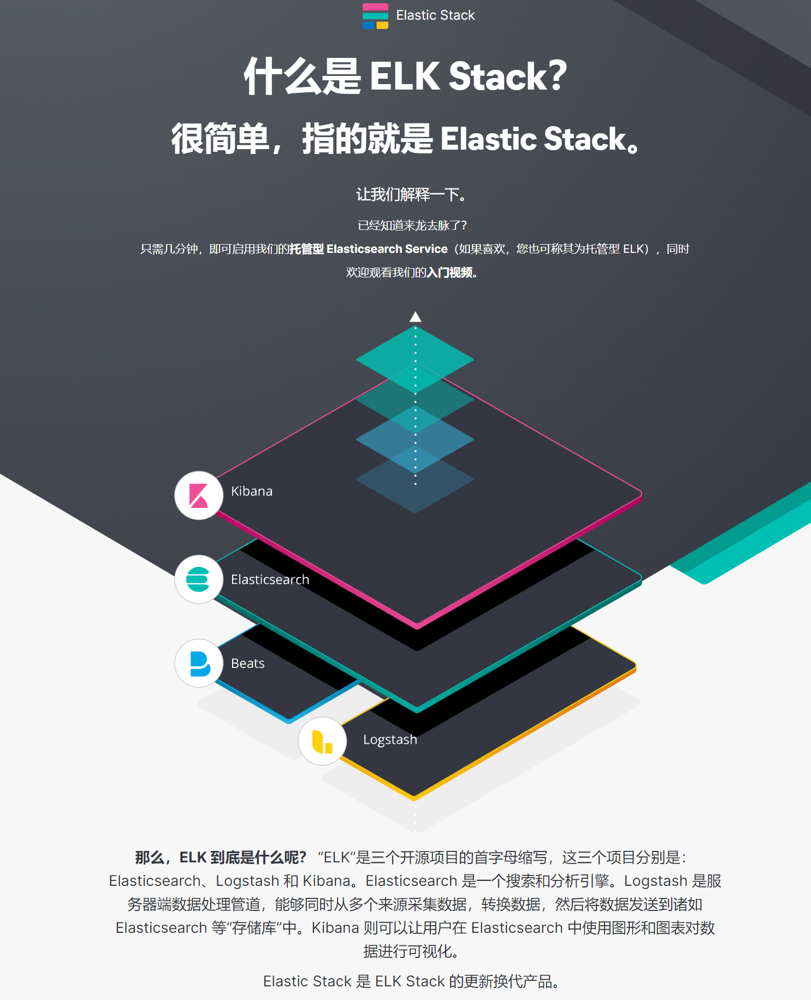

## ElasticStack

### 什么是 ELK？
ELK是三个开源项目的首字母缩写，这三个项目分别是：Elasticsearch、Logstash 和 Kibana。
- Elasticsearch 是一个搜索和分析引擎。
- Logstash 是服务器端数据处理管道，能够同时从多个来源采集数据，转换数据，然后将数据发送到诸如 Elasticsearch 等“存储库”中。
- Kibana 则可以让用户在 Elasticsearch 中使用图形和图表对数据进行可视化。

### [什么是 ELK Stack？](https://www.elastic.co/cn/what-is/elk-stack)

[Elastic Stack](https://www.elastic.co/cn/elastic-stack) 是 ELK Stack 的更新换代产品。
即 ElasticSearch + Logstash + Kibana + Beats等

### 笔记列表
> bilibili 黑马程序员的学习视频：[Elastic Stack（ELK）从入门到实践](https://www.bilibili.com/video/BV1iJ411c7Az)

- [搭建ELK分布式日志解决方案](/ElasticStack/搭建ELK分布式日志解决方案/README.md)
