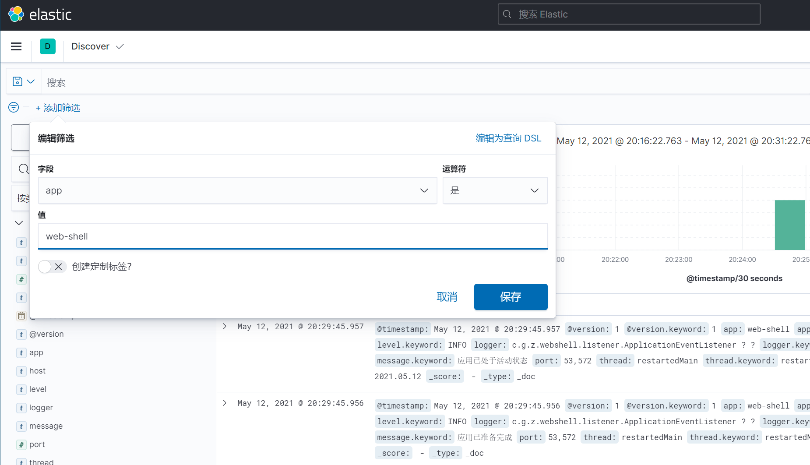

### 介绍
ELK是三个开源项目的首字母缩写，这三个项目分别是：Elasticsearch、Logstash 和 Kibana。
- Elasticsearch 是一个搜索和分析引擎。
- Logstash 是服务器端数据处理管道，能够同时从多个来源采集数据，转换数据，然后将数据发送到诸如 Elasticsearch 等“存储库”中。
- Kibana 则可以让用户在 Elasticsearch 中使用图形和图表对数据进行可视化。
### 克隆一台虚拟机
- 从之前装好jdk的centos虚拟机快照克隆一台专门搭建elk环境


- 克隆完成以后开机，登录
- 修改主机名
```shell
vim /etc/hostname
zmzhou-132-elk
```
- 修改ip地址
```shell
vim /etc/sysconfig/network-scripts/ifcfg-ens33
TYPE=Ethernet
PROXY_METHOD=none
BROWSER_ONLY=no
BOOTPROTO=static
DEFROUTE=yes
IPV4_FAILURE_FATAL=no
IPV6INIT=yes
IPV6_AUTOCONF=yes
IPV6_DEFROUTE=yes
IPV6_FAILURE_FATAL=no
IPV6_ADDR_GEN_MODE=stable-privacy
NAME=ens33
#UUID=d77bb448-a7db-4b0f-9812-b306e44c5d3b
DEVICE=ens33
ONBOOT=yes
IPADDR=192.168.163.132
GATEWAY=192.168.163.2
NETMASK=255.255.255.0
DNS1=8.8.8.8
DNS2=114.114.114.114
```
- 重启 `reboot`
- 检查IP，网络和Java环境


如果Java环境没有配好，请参考 [jdk1.8商用免费版下载地址](/程序员之友/提高生产力必须知道的网站/README.md)
下载，并配置环境变量：
```shell
vim /etc/profile
# 在最后添加如下内容：ZZ保存退出以后执行 source /etc/profile
export JAVA_HOME=/usr/java/jdk1.8.0_202
export JRE_HOME=$JAVA_HOME/jre
export PATH=$PATH:$JAVA_HOME/bin:$JRE_HOME/bin
export CLASSPATH=.:$JAVA_HOME/lib:$JRE_HOME/lib:$JAVA_HOME/lib/dt.jar:$JAVA_HOME/lib/tools.jar
export ES_JAVA_HOME=/home/elastic/elasticsearch-7.12.1/jdk
```
### 安装 elasticsearch
- `lscpu` 查看系统架构


- 下载相应版本的 elasticsearch [https://www.elastic.co/cn/downloads/elasticsearch](https://www.elastic.co/cn/downloads/elasticsearch)
  


- 创建用户elastic `useradd elastic` 上传安装包到 `/home/elastic/` 目录下
- 解压，修改配置文件，启动
```shell
tar -zxvf elasticsearch-7.12.1-linux-x86_64.tar.gz 
cd elasticsearch-7.12.1/
vim config/elasticsearch.yml 
# 修改如下内容
cluster.name: zmzhou-132-elk
node.name: es-node-1
path.data: /home/elastic/elasticsearch-7.12.1/data
path.logs: /home/elastic/elasticsearch-7.12.1/logs
bootstrap.memory_lock: false
bootstrap.system_call_filter: false
network.host: 0.0.0.0
http.port: 9200
discovery.seed_hosts: ["127.0.0.1", "zmzhou-132-elk"]
cluster.initial_master_nodes: ["es-node-1"]
```
```shell
# 修改文件夹所属用户权限
chown -R elastic:elastic /home/elastic/
# 切换用户
su - elastic
cd elasticsearch-7.12.1/
# 后台启动
./bin/elasticsearch -d
```
#### 报错以及解决办法
- 报错1 `JAVA_HOME is deprecated, use ES_JAVA_HOME`
  

```shell
vim /etc/profile
export ES_JAVA_HOME=/home/elastic/elasticsearch-7.12.1/jdk
source /etc/profile
```
- 报错2 ERROR: bootstrap checks failed
```text
[2] bootstrap checks failed. You must address the points described in the following [2] lines before starting Elasticsearch.
bootstrap check failure [1] of [2]: max virtual memory areas vm.max_map_count [65530] is too low, increase to at least [262144]
bootstrap check failure [2] of [2]: the default discovery settings are unsuitable for production use; at least one of [discovery.seed_hosts, discovery.seed_providers, cluster.initial_master_nodes] must be configured
```
解决：`[1]`编辑 `sysctl.conf` 添加如下配置
```shell
# echo "vm.max_map_count=262144" >> /etc/sysctl.conf
# sysctl -p  #使修改立即生效
```
`[2]`在`elasticsearch.yml`中加上如下配置：
```yaml
discovery.seed_hosts: ["127.0.0.1", "zmzhou-132-elk"]
cluster.initial_master_nodes: ["es-node-1"]
```

- 报错3 ERROR: bootstrap checks failed
```text
max file descriptors [4096] for elasticsearch process likely too low, increase to at least [65536]
max number of threads [1024] for user [elastic] likely too low, increase to at least [2048]
```
解决：`[1]` 切换到root用户，编辑limits.conf 根据错误提示添加如下内容:

```shell
vim /etc/security/limits.conf 
#添加如下内容
* soft nofile 65536
* hard nofile 131072
* soft nproc 2048
* hard nproc 4096
```

`[2]`编辑 `90-nproc.conf ` 修改配置
```shell
vim /etc/security/limits.d/90-nproc.conf
#修改为
* soft nproc 2048
```

- 报错4 bootstrap checks failed
```text
bootstrap checks failed
system call filters failed to install; check the logs and fix your configuration or disable system call filters at your own risk
```
解决：在`elasticsearch.yml`中加上如下配置：
```yaml
bootstrap.memory_lock: false
bootstrap.system_call_filter: false
```
- 查看日志 `tail -100f /home/elastic/elasticsearch-7.12.1/logs/zmzhou-132-elk.log `, 启动成功如下：
  


### 安装 Logstash
- 下载相应版本的 Logstash [https://www.elastic.co/cn/downloads/logstash](https://www.elastic.co/cn/downloads/logstash)


- 解压，修改配置文件
```shell
tar -zxvf logstash-7.12.1-linux-x86_64.tar.gz 
cd logstash-7.12.1/
cp config/logstash-sample.conf config/logstash.conf
vim startup.sh
#编辑如下内容，保存退出
#!/bin/bash
nohup ./bin/logstash -f config/logstash.conf &
chmod +x startup.sh
```
`vim config/logstash.conf` 添加配置如下
```text
input {
  beats {
    port => 5044
  }
  tcp {
    mode => "server"
    host => "0.0.0.0"  # 允许任意主机发送日志
    type => "elk1"      # 设定type以区分每个输入源
    port => 4567      
    codec => json_lines   # 数据格式
  }
}
output {
  if [type] == "elk1" {
    elasticsearch {
      action => "index"          # 输出时创建映射
      hosts  => "192.168.163.132:9200"   # ElasticSearch 的地址和端口
      index  => "elk1-%{+YYYY.MM.dd}"         # 指定索引名
      codec  => "json"
     }
  }
}
```
- 启动 logstash
```shell
./startup.sh
#查看日志
tail -100f nohup.out
```
### 安装 Kibana
- 下载相应版本的 Kibana [https://www.elastic.co/cn/downloads/kibana](https://www.elastic.co/cn/downloads/kibana)
  

- 解压，修改配置文件，启动
```shell
tar -zxvf kibana-7.12.1-linux-x86_64.tar.gz 
cd kibana-7.12.1-linux-x86_64/
vim config/kibana.yml 
#修改如下内容：
server.port: 5601
server.host: "0.0.0.0"
server.name: "zmzhou-132-elk"
elasticsearch.hosts: ["http://localhost:9200"]
kibana.index: ".kibana"
i18n.locale: "zh-CN"
# 后台启动
nohup ./bin/kibana &
```
- 启动成功访问：`http://192.168.163.132:5601/`


### springboot + logback 输出日志到 logstash
- 添加 logstash 依赖 `pom.xml`
```xml
<!-- https://mvnrepository.com/artifact/net.logstash.logback/logstash-logback-encoder -->
<dependency>
  <groupId>net.logstash.logback</groupId>
  <artifactId>logstash-logback-encoder</artifactId>
  <version>6.6</version>
</dependency>
```
- 修改 `application.yml`，添加配置
```yaml
logstash:
  address: 192.168.163.132:4567
```
- 修改 `logback-spring.xml` 配置
```xml
<?xml version="1.0" encoding="UTF-8"?>
<configuration>
    <!-- logstash地址，从 application.yml 中获取-->
    <springProperty scope="context" name="LOGSTASH_ADDRESS" source="logstash.address"/>
    <springProperty scope="context" name="APPLICATION_NAME" source="spring.application.name"/>
    <!--日志在工程中的输出位置-->
    <property name="LOG_FILE" value="/opt/web-shell/logging"/>
    <!-- 彩色日志依赖的渲染类 -->
    <conversionRule conversionWord="clr" converterClass="org.springframework.boot.logging.logback.ColorConverter"/>
    <conversionRule conversionWord="wex"
                    converterClass="org.springframework.boot.logging.logback.WhitespaceThrowableProxyConverter"/>
    <conversionRule conversionWord="wEx"
                    converterClass="org.springframework.boot.logging.logback.ExtendedWhitespaceThrowableProxyConverter"/>
    <!--控制台的日志输出样式-->
    <property name="CONSOLE_LOG_PATTERN"
              value="%clr(%d{HH:mm:ss.SSS}){faint} %clr(${LOG_LEVEL_PATTERN:-%5p}) %clr(${PID:- }){magenta} %clr(---){faint} %clr([%15.15t]){faint} %clr(%-40.40logger{39}){cyan} %clr(:){faint} %m%n${LOG_EXCEPTION_CONVERSION_WORD:-%wEx}}"/>
    <!-- 控制台输出 -->
    <appender name="console" class="ch.qos.logback.core.ConsoleAppender">
        <filter class="ch.qos.logback.classic.filter.ThresholdFilter">
            <level>INFO</level>
        </filter>
        <!-- 日志输出编码 -->
        <encoder>
            <pattern>${CONSOLE_LOG_PATTERN}</pattern>
            <charset>utf8</charset>
        </encoder>
    </appender>
    <!--文件-->
    <appender name="fileAppender" class="ch.qos.logback.core.rolling.RollingFileAppender">
        <!-- 多JVM同时操作同一个日志文件 -->
        <Prudent>false</Prudent>
        <rollingPolicy class="ch.qos.logback.core.rolling.TimeBasedRollingPolicy">
            <FileNamePattern>
                ${LOG_FILE}.%d{yyyy-MM-dd}.log
            </FileNamePattern>
            <!-- 日志最大的历史 10天 -->
            <maxHistory>10</maxHistory>
        </rollingPolicy>
        <layout class="ch.qos.logback.classic.PatternLayout">
            <Pattern>
                %d{yyyy-MM-dd HH:mm:ss} %-5level logger{39} -%msg%n
            </Pattern>
        </layout>
    </appender>
    <!--输出到logstash的appender-->
    <appender name="LOGSTASH" class="net.logstash.logback.appender.LogstashTcpSocketAppender">
        <!--可以访问的logstash日志收集端口-->
        <destination>${LOGSTASH_ADDRESS}</destination>
        <encoder class="net.logstash.logback.encoder.LoggingEventCompositeJsonEncoder">
            <providers>
                <timestamp>
                    <timeZone>Asia/Shanghai</timeZone>
                </timestamp>
                <pattern>
                    <pattern>
                        {
                        "app": "${APPLICATION_NAME}",
                        "level": "%level",
                        "thread": "%thread",
                        "logger": "%logger{50} %M %L ",
                        "message": "%msg"
                        }
                    </pattern>
                </pattern>
                <stackTrace>
                    <throwableConverter class="net.logstash.logback.stacktrace.ShortenedThrowableConverter">
                        <maxDepthPerThrowable>100</maxDepthPerThrowable>
                        <rootCauseFirst>true</rootCauseFirst>
                        <inlineHash>true</inlineHash>
                    </throwableConverter>
                </stackTrace>
            </providers>
        </encoder>
    </appender>
    <root level="INFO">
        <appender-ref ref="console"/>
        <appender-ref ref="fileAppender"/>
        <appender-ref ref="LOGSTASH"/>
    </root>
</configuration>
```
### springboot + log4j2 异步输出日志到 logstash
- 修改 `log4f2.xml`
```xml
<?xml version="1.0" encoding="UTF-8"?>
<!--日志级别以及优先级排序: OFF > FATAL > ERROR > WARN > INFO > DEBUG > TRACE > ALL -->
<!--Configuration后面的status，这个用于设置log4j2自身内部的信息输出，可以不设置，当设置成trace时，你会看到log4j2内部各种详细输出-->
<!--monitorInterval：Log4j能够自动检测修改配置 文件和重新配置本身，设置间隔秒数-->
<configuration status="warn" name="web-shell" monitorInterval="300">
  <properties>
    <property name="LOG_HOME">/opt/web-shell/logs</property>
    <property name="maxHistory">7</property>
    <!-- 这个都知道是输出日志的格式 -->
    <property name="pattern">%d{yyyy-MM-dd HH:mm:ss z} [%thread] %-5level %class{36} [%M:%L] - %msg%xEx%n</property>
    <property name="console_pattern">%d{HH:mm:ss.SSS} [%thread] %-5level %class{36} [%M:%L] - %msg%xEx%n</property>
    <property name="logstash_pattern">{"app": "web-shell", "level": "%level", "message": "%thread %M %L - %msg%xEx%n"}</property>
  </properties>
  <!--先定义所有的appender -->
  <appenders>
    <!--这个输出控制台的配置 -->
    <Console name="Console" target="SYSTEM_OUT">
      <!-- 控制台只输出level及以上级别的信息（onMatch），其他的直接拒绝（onMismatch） -->
      <ThresholdFilter level="trace" onMatch="ACCEPT" onMismatch="DENY"/>
      <PatternLayout pattern="${console_pattern}"/>
    </Console>
    <!--文件会打印出所有信息，这个log每次运行程序会自动清空，由append属性决定，这个也挺有用的，适合临时测试用 -->
    <!--append为TRUE表示消息增加到指定文件中，false表示消息覆盖指定的文件内容，默认值是true -->
    <File name="log" fileName="${LOG_HOME}/log4j2.log" append="false">
      <PatternLayout pattern="${console_pattern}"/>
      <ThresholdFilter level="warn" onMatch="ACCEPT" onMismatch="DENY"/>
    </File>
    <!-- 打印出所有的error信息，每次大小超过size，则这size大小的日志会自动存入按年份-月份建立的文件夹下面并进行压缩，作为存档 -->
    <RollingFile name="errorRollingFile" fileName="${LOG_HOME}/error.log"
                 filePattern="${LOG_HOME}/$${date:yyyy-MM}/%d{yyyy-MM-dd}-error-%i.log.gz">
      <PatternLayout pattern="${pattern}"/>
      <!--控制台只输出level及以上级别的信息（onMatch），其他的直接拒绝（onMismatch）-->
      <ThresholdFilter level="error" onMatch="ACCEPT" onMismatch="DENY"/>
      <Policies>
        <TimeBasedTriggeringPolicy/>
        <SizeBasedTriggeringPolicy size="100 MB"/>
      </Policies>
      <DefaultRolloverStrategy max="${maxHistory}"/>
    </RollingFile>
    <!-- 打印出所有的warn信息，每次大小超过size，则这size大小的日志会自动存入按年份-月份建立的文件夹下面并进行压缩，作为存档 -->
    <RollingFile name="warnRollingFile" fileName="${LOG_HOME}/warn.log"
                 filePattern="${LOG_HOME}/$${date:yyyy-MM}/%d{yyyy-MM-dd}-warn-%i.log.gz">
      <PatternLayout pattern="${pattern}"/>
      <!--控制台只输出level及以上级别的信息（onMatch），其他的直接拒绝（onMismatch）-->
      <ThresholdFilter level="warn" onMatch="ACCEPT" onMismatch="DENY"/>
      <Policies>
        <TimeBasedTriggeringPolicy/>
        <SizeBasedTriggeringPolicy size="100 MB"/>
      </Policies>
      <DefaultRolloverStrategy max="${maxHistory}"/>
    </RollingFile>
    <!-- 打印出所有的info信息，每次大小超过size，则这size大小的日志会自动存入按年份-月份建立的文件夹下面并进行压缩，作为存档 -->
    <RollingFile name="infoRollingFile" fileName="${LOG_HOME}/info.log"
                 filePattern="${LOG_HOME}/$${date:yyyy-MM}/%d{yyyy-MM-dd}-info-%i.log.gz">
      <PatternLayout pattern="${pattern}"/>
      <ThresholdFilter level="info" onMatch="ACCEPT" onMismatch="DENY"/>
      <Policies>
        <TimeBasedTriggeringPolicy/>
        <SizeBasedTriggeringPolicy size="100 MB"/>
      </Policies>
      <DefaultRolloverStrategy max="${maxHistory}"/>
    </RollingFile>
    <!-- 和logstash建立Socket连接 -->
    <Socket name="logstash" host="192.168.163.132" port="4567" protocol="TCP">
      <PatternLayout pattern="${logstash_pattern}" />
    </Socket>
  </appenders>
  <!--然后定义logger，只有定义了logger并引入的appender，appender才会生效 -->
  <loggers>
    <!--过滤掉spring和hibernate的一些无用的DEBUG信息-->
    <logger name="org.hibernate" level="INFO"/>
    <logger name="org.springframework" level="INFO"/>
    <!-- 日志输出到logstash -->
    <logger name="com.github.zmzhoustar" level="info" includeLocation="false" >
      <appender-ref ref="logstash" />
    </logger>
    <root level="INFO">
      <appender-ref ref="Console"/>
      <appender-ref ref="log"/>
      <appender-ref ref="infoRollingFile"/>
      <appender-ref ref="warnRollingFile"/>
      <appender-ref ref="errorRollingFile"/>
    </root>
  </loggers>
</configuration>
```
- 本项目地址: [https://gitee.com/zmzhou-star/web-shell](https://gitee.com/zmzhou-star/web-shell)
### 测试，启动spring boot项目，访问 `http://192.168.163.132:5601/`
- 创建索引，我们之前在 logstash 配置的索引规则是以 elk1 开头：


- 筛选我们的应用名




- 至此，我们的ELK环境已经搭好啦，不过还有更多功能等待解锁，比如 **Beats等**，整个软件目录如下


- [设置Nginx反向代理账号密码访问](/Linux/设置Nginx访问账号密码/README.md)

- JVM Support Matrix [https://www.elastic.co/cn/support/matrix#matrix_jvm](https://www.elastic.co/cn/support/matrix#matrix_jvm)

### 防火墙相关命令
```shell
# 启动：
systemctl start firewalld
# 查看状态：
systemctl status firewalld 
firewall-cmd --state
# 停止：
systemctl disable firewalld
#禁用：
systemctl stop firewalld
#查看所有打开的端口
firewall-cmd --zone=public --list-ports
#添加一个端口
firewall-cmd --zone=public --add-port=80/tcp --permanent
firewall-cmd --zone=public --add-port=4567/tcp --permanent
firewall-cmd --zone=public --add-port=5601/tcp --permanent
#删除一个端口
firewall-cmd --zone=public --remove-port=80/tcp --permanent
#更新防火墙规则
firewall-cmd --reload
```
