### GitHub Action 是 GitHub 于 2019 年 11 月正式推出的一个 CI/CD 服务。
### GitHub Action 基本概念
- workflow （工作流程）：持续集成一次运行的过程，就是一个 workflow。
- job （任务）：一个 workflow 由一个或多个 jobs 构成，含义是一次持续集成的运行，可以完成多个任务。
- step（步骤）：每个 job 由多个 step 构成，一步步完成。
- action （动作）：每个 step 可以依次执行一个或多个命令（action）。

### CI/CD 其实是三件事情
- 持续集成（Continuous Integration）
- 持续交付（Continuous Delivery）
- 持续部署（Continuous Deployment）
- 下面借用三幅图来说明

#### 持续集成：
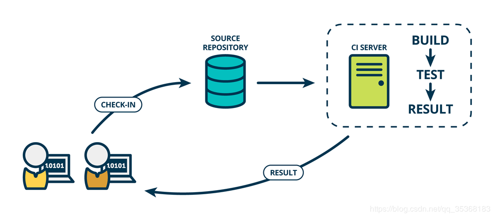
- 持续集成的流程：
  - 开发人员提交代码到GIT源代码仓库，并通过 git hook 等
  - 触发持续集成服务器的相关功能。执行 编译 -> 测试 -> 输出结果 的流程
  - 向开发人员反馈结果报告
- 我们在日常开发中经常使用到的集成方式是「阶段集成」（完成一个阶段的开发后执行代码的集成），相比较而言，「持续集成」能给我们带来的好处有哪些？
  - 方便定位错误：每一次的代码集成都需要执行相关的测试工作，持续集成频繁的集成次数天然的将复杂的代码逻辑切割为了小块，也就使得每一次测试中遇到的错误能够更加容易的被定位；
  - 方便控制开发流程：更为细致的工作提交也就意味着更容易判断当前的工作进度，这对于管理者规划开发流程而言提供了一个有效的参考，同时也为开发人员省下了汇报工作的时间；
  - 方便Code Review：对于大块工作的切分自然也有助于做 CodeReview；
  - 减少不必要的工作：构建和测试过程的自动化可以为你节约大把的时间，从而投入到有价值的工作中去。
  
#### 持续交付
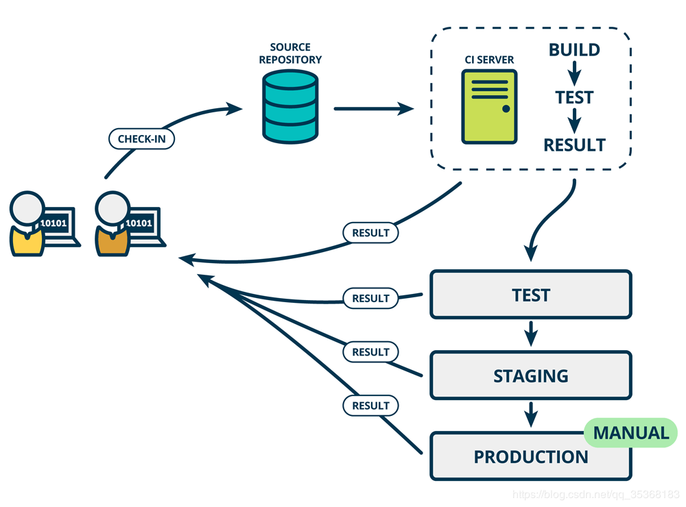

- 「持续交付」 指的是：一种能够使得软件在较短的循环中可靠的发布的软件工程方法。
  - 与「持续集成」相比，持续交付的侧重点在于 交付 ，其核心对象不在于代码，而在于可交付的产物。
  - 「持续集成」仅仅针对于新旧代码的集成过程执行了一定的测试，其变动到持续交付后还需要一些额外的流程。
  - 从上面这张图可以看到，与「持续集成」相比较，持续交付 添加了 Test -> Staging -> Production 的流程，也就是为新增的代码添加了一个保证：确保新增的代码在生产环境中是可用的。
  - 在这一增加的流程中，Test 环节不仅仅包含基本的单元测试，还需要延伸到更为复杂的功能测试以及集成测试等。
  - 在这里，Staging 指的是 类生产环境 ，其尽可能的对真实的网络拓扑、数据库数据以及硬件设备等资源进行模拟，从而为测试人员反馈代码在生成环境中的可能表现。
  - 流程中每一个环节的执行结果都会对开发人员进行反馈，每一个出现的错误都会导致版本的回滚。
  - 当测试完毕确认无误之后，将由相关人员对其进行 手动 部署到生产环境。
  
#### 持续部署
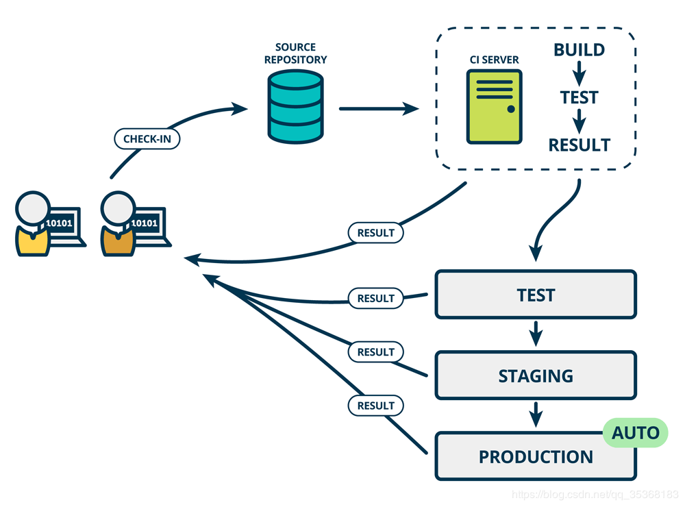
- 「持续部署」意味着：通过自动化部署的手段将软件功能频繁的进行交付。
  - 与「持续交付」以及「持续集成」相比，「持续部署」强调了通过 automated deployment 的手段，对新的软件功能进行集成。
  - 通过和「持续交付」的图对比，区别主要体现在对 Production 的自动化。
  - 从开发人员提交代码到编译、测试、部署的全流程不需要人工的干预，完全通过自动化的方式执行。
  - 这一策略加快了代码提交到功能上线的速度，保证新的功能能够第一时间部署到生产环境并被使用。
  - 从前面这些介绍可以看到，CI/CD 是由很多操作组成，比如抓取代码、运行测试、登录远程服务器，发布到第三方服务等等。GitHub 把这些操作就称为 actions。
  - 很多操作在不同项目里面是类似的，完全可以共享。GitHub 注意到了这一点，想出了一个很妙的点子，允许开发者把每个操作写成独立的脚本文件，存放到代码仓库，使得其他开发者可以引用。
  - 如果你需要某个 action，不必自己写复杂的脚本，直接引用他人写好的 action 即可，整个持续集成过程，就变成了一个 actions 的组合。这就是 GitHub Actions 最特别的地方。 
    
- GitHub 做了一个官方市场，可以搜索到他人提交的 actions。[https://github.com/marketplace?type=actions](https://github.com/marketplace?type=actions)

### Java CI with Maven
- 创建一个项目，Creating encrypted secrets for a repository
  - On GitHub, navigate to the main page of the repository.
  - Under your repository name, click  Settings.
  - Repository settings button
  - In the left sidebar, click Secrets.
  - Click New repository secret.
  - Type a name for your secret in the Name input box.
  - Enter the value for your secret.
  - Click Add secret.
- 然后点击项目中 Actions，选择一个工作流

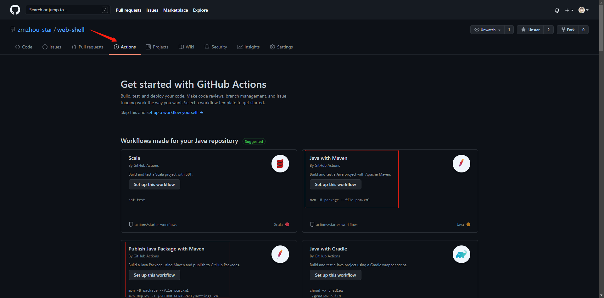
- 选择 Java with Maven，修改内容如下，然后提交，每当我们提交代码，或者合并请求到main分支时就会触发执行工作流

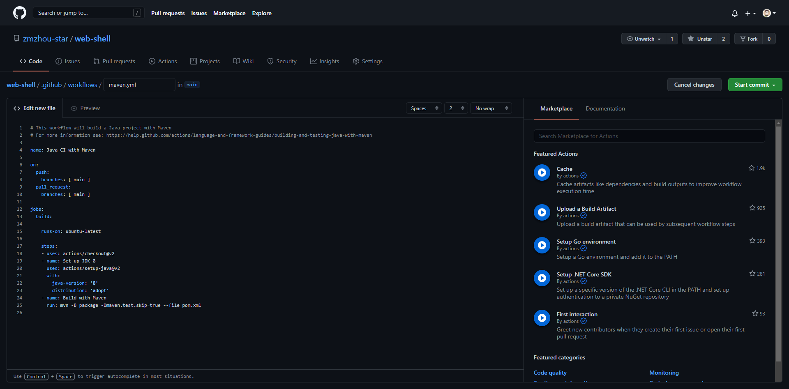
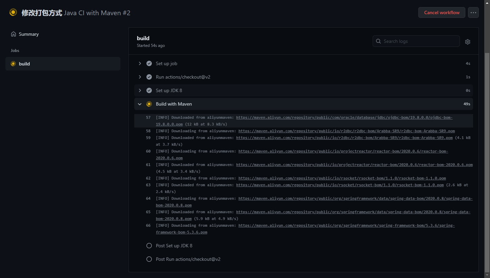
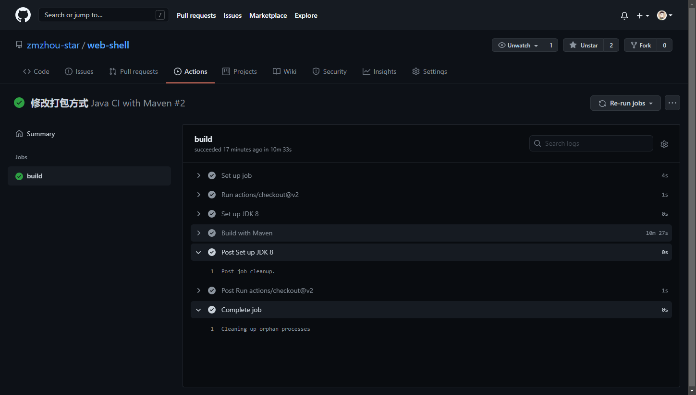
- 选择 Publish Java Package with Maven，修改内容如下，然后提交，当我们新建一个release时，会打包发布到GitHub Packages，提供下载页面

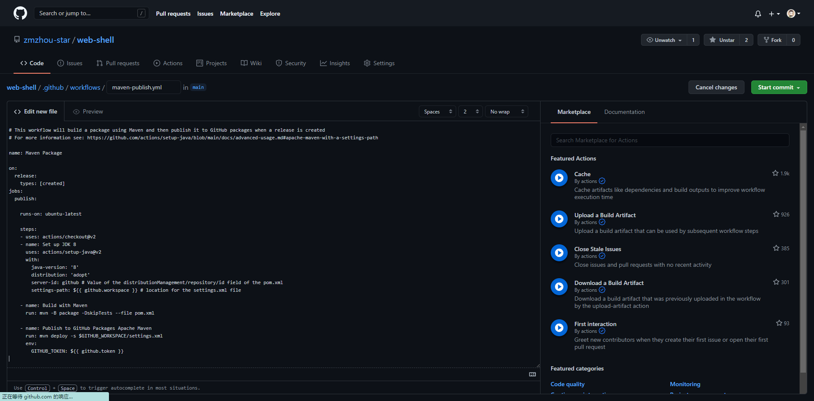
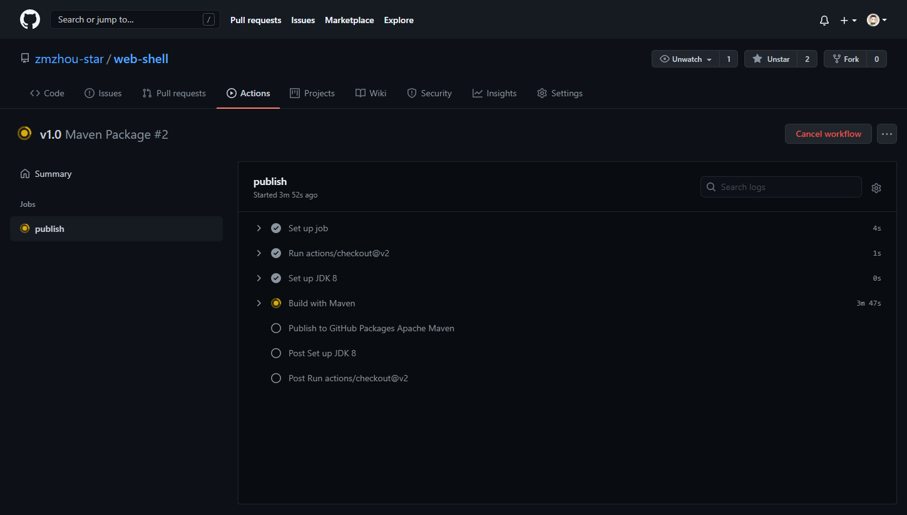

- 如果任务执行失败，就会收到如下邮件，点击可进入GitHub查看失败原因；
  
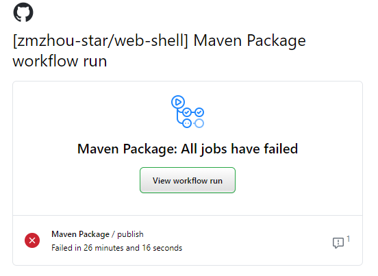

- 发布成功后就出现如下下载页面

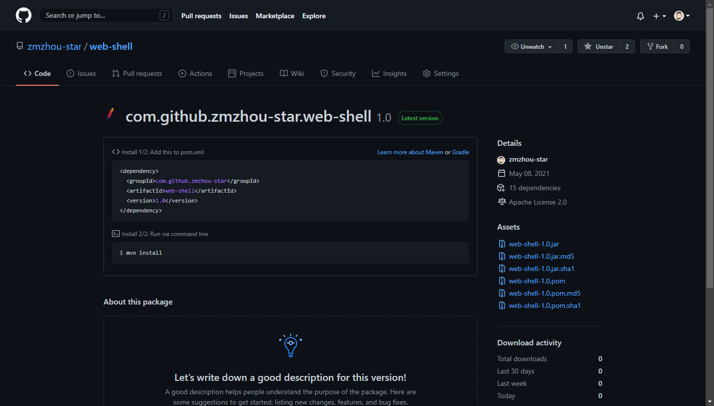

我们下载下来之后可以执行命令：`java -jar -server web-shell-1.0.jar` 直接运行。

- 更多GitHub Action配置参考 [https://docs.github.com/cn/actions/reference/encrypted-secrets](https://docs.github.com/cn/actions/reference/encrypted-secrets)