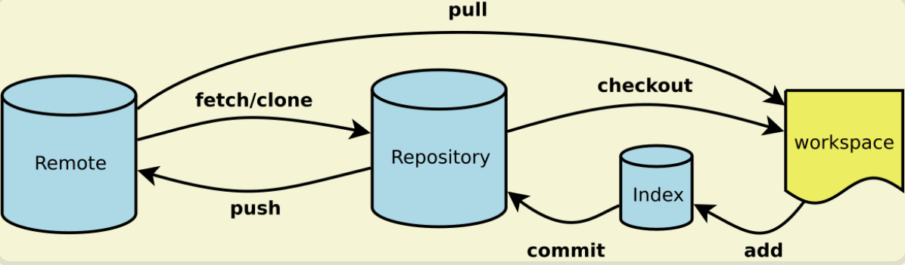
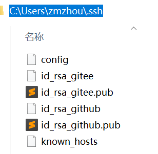
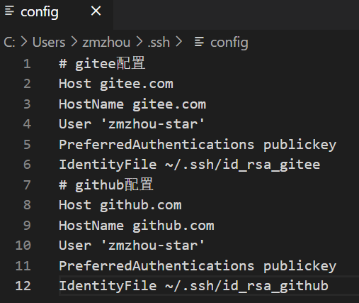

> Git常用命令速查手册

- 一般来说，日常使用只要记住下图6个命令，就可以了。但是熟练使用，恐怕要记住60～100个命令。

  - Workspace：工作区
  - Index / Stage：暂存区
  - Repository：仓库区（或本地仓库）
  - Remote：远程仓库
- [Git下载安装](https://git-scm.com/downloads)
> [SSH 公钥设置](https://gitee.com/help/articles/4191#article-header0)

```shell
$ ssh-keygen -t rsa -C "your@email.com" [-f 文件名]
# 一直回车，可以不用填生成密码，例如
$ ssh-keygen -t rsa -C "zmzhou8@qq.com" -f ~/.ssh/id_rsa_gitee
$ ssh-keygen -t rsa -C "zmzhou8@qq.com" -f ~/.ssh/id_rsa_github
# 打开 https://gitee.com/profile/sshkeys 添加SSH公钥 (复制 id_rsa_gitee.pub 文件内容)
```
> [Git配置多个SSH-Key](https://gitee.com/help/articles/4229#article-header0)

- 生成多个git服务器的公钥，添加配置
```shell
# gitee配置
Host gitee.com
HostName gitee.com
User 'zmzhou-star'
PreferredAuthentications publickey
IdentityFile ~/.ssh/id_rsa_gitee
# github配置
Host github.com
HostName github.com
User 'zmzhou-star'
PreferredAuthentications publickey
IdentityFile ~/.ssh/id_rsa_github
```




> 配置显示的用户名和邮箱，如有其它外网的git项目，建议每个项目分别配置（在当前项目目录执行并去掉global参数）
```shell
$ git config [--global] user.name "你的名字或昵称"
$ git config [--global] user.email "你的邮箱"
# 显示当前的Git配置
$ git config [--global] --list
# 编辑Git配置文件
$ git config -e [--global]
```
> 初始本地仓库
```shell
# 方法一：
$ git init [learnotes] #在当前目录下初始化一个文件夹<learnotes>
$ cd learnotes
#去git上面复制远程仓库地址https://gitee.com/zmzhou-star/learnotes.git
$ git remote add origin https://gitee.com/zmzhou-star/learnotes.git
$ git fetch
$ git pull origin master 
# 方法二：
$ git clone https://gitee.com/zmzhou-star/learnotes.git
```
> 更换远程仓库地址
```shell
git remote set-url origin https://github.com/zmzhou-star/learnotes.git
```

> 添加（删除）多个远程仓库地址
```shell
git remote set-url origin https://github.com/zmzhou-star/learnotes.git
git remote set-url --add origin https://gitee.com/zmzhou-star/learnotes.git
# 删除
git remote set-url --delete origin https://gitee.com/zmzhou-star/learnotes.git
```

> 增加/删除文件
```shell
$ git add . #将当前目录所有文件添加到git暂存区
$ git commit -m "my first commit" #提交并备注提交信息
$ git push origin master #将本地提交推送到远程仓库
# 添加指定文件到暂存区
$ git add [file1] [file2] ...
# 添加指定目录到暂存区，包括子目录
$ git add [dir]
# 添加每个变化前，都会要求确认
# 对于同一个文件的多处变化，可以实现分次提交
$ git add -p
# 删除工作区文件，并且将这次删除放入暂存区
$ git rm [file1] [file2] ...
# 停止追踪指定文件，但该文件会保留在工作区
$ git rm --cached [file]
# 改名文件，并且将这个改名放入暂存区
$ git mv [file-original] [file-renamed]
# 提交暂存区的指定文件到仓库区
$ git commit [file1] [file2] ... -m [message]
# 提交工作区自上次commit之后的变化，直接到仓库区
$ git commit -a
# 提交时显示所有diff信息
$ git commit -v
# 使用一次新的commit，替代上一次提交
# 如果代码没有任何新变化，则用来改写上一次commit的提交信息
$ git commit --amend -m [message]
# 重做上一次commit，并包括指定文件的新变化
$ git commit --amend [file1] [file2] ...
```
> 分支
```shell
# 列出所有本地分支
$ git branch
# 列出所有远程分支
$ git branch -r
# 列出所有本地分支和远程分支
$ git branch -a
# 新建一个分支，但依然停留在当前分支
$ git branch [branch-name]
# 新建一个分支，并切换到该分支
$ git checkout -b [branch]
# 新建一个分支，指向指定commit
$ git branch [branch] [commit]
# 新建一个分支，与指定的远程分支建立追踪关系
$ git branch --track [branch] [remote-branch]
# 切换到指定分支，并更新工作区
$ git checkout [branch-name]
# 切换到上一个分支
$ git checkout -
# 建立追踪关系，在现有分支与指定的远程分支之间
$ git branch --set-upstream [branch] [remote-branch]
# 合并指定分支到当前分支
$ git merge [branch]
# 选择一个commit，合并进当前分支
$ git cherry-pick [commit]
# 删除分支
$ git branch -d [branch-name]
# 删除远程分支
$ git push origin --delete [branch-name]
$ git branch -dr [remote/branch]
# git 清理本地分支，同步远程分支（过滤远程已经删除的分支）
$ git remote show origin
$ git remote prune origin
# 批量删除本地分支
$ git branch -a | grep -v -E 'master|develop' |grep 'xxx' | xargs git branch -D
# 批量删除远程分支 grep -v -E 排除master 和 develop -v 排除 -E 使用正则表达式
$ git branch -r| grep -v -E 'master|develop'|grep 'xxx' | sed 's/origin\///g' | xargs -I {} git push origin :{}
```
> 标签
```shell
# 列出所有tag
$ git tag
# 新建一个tag在当前commit
$ git tag [tag]
# 新建一个tag在指定commit
$ git tag [tag] [commit]
# 删除本地tag
$ git tag -d [tag]
# 删除远程tag
$ git push origin :refs/tags/[tagName]
# 查看tag信息
$ git show [tag]
# 提交指定tag
$ git push [remote] [tag]
# 提交所有tag
$ git push [remote] --tags
# 新建一个分支，指向某个tag
$ git checkout -b [branch] [tag]
```
> 查看信息
```shell
# 显示有变更的文件
$ git status
# 显示当前分支的版本历史
$ git log
# 显示commit历史，以及每次commit发生变更的文件
$ git log --stat
# 搜索提交历史，根据关键词
$ git log -S [keyword]
# 显示某个commit之后的所有变动，每个commit占据一行
$ git log [tag] HEAD --pretty=format:%s
# 显示某个commit之后的所有变动，其"提交说明"必须符合搜索条件
$ git log [tag] HEAD --grep feature
# 显示某个文件的版本历史，包括文件改名
$ git log --follow [file]
$ git whatchanged [file]
# 显示指定文件相关的每一次diff
$ git log -p [file]
# 显示过去5次提交
$ git log -5 --pretty --oneline
# 显示所有提交过的用户，按提交次数排序
$ git shortlog -sn
# 显示指定文件是什么人在什么时间修改过
$ git blame [file]
# 显示暂存区和工作区的差异
$ git diff
# 显示暂存区和上一个commit的差异
$ git diff --cached [file]
# 显示工作区与当前分支最新commit之间的差异
$ git diff HEAD
# 显示两次提交之间的差异
$ git diff [first-branch]...[second-branch]
# 显示今天你写了多少行代码
$ git diff --shortstat "@{0 day ago}"
# 显示某次提交的元数据和内容变化
$ git show [commit]
# 显示某次提交发生变化的文件
$ git show --name-only [commit]
# 显示某次提交时，某个文件的内容
$ git show [commit]:[filename]
# 显示当前分支的最近几次提交
$ git reflog
```
> 远程同步
```shell
# 下载远程仓库的所有变动
$ git fetch [remote]
# 显示所有远程仓库
$ git remote -v
# 显示某个远程仓库的信息
$ git remote show [remote]
# 增加一个新的远程仓库，并命名
$ git remote add [shortname] [url]
# 取回远程仓库的变化，并与本地分支合并
$ git pull [remote] [branch]
# 上传本地指定分支到远程仓库
$ git push [remote] [branch]
# 强行推送当前分支到远程仓库，即使有冲突
$ git push [remote] --force
# 推送所有分支到远程仓库
$ git push [remote] --all
```
> 撤销
```shell
# 恢复暂存区的指定文件到工作区
$ git checkout [file]
# 恢复某个commit的指定文件到暂存区和工作区
$ git checkout [commit] [file]
# 恢复暂存区的所有文件到工作区
$ git checkout .
# 重置暂存区的指定文件，与上一次commit保持一致，但工作区不变
$ git reset [file]
# 重置暂存区与工作区，与上一次commit保持一致
$ git reset --hard
# 重置当前分支的指针为指定commit，同时重置暂存区，但工作区不变
$ git reset [commit]
# 重置当前分支的HEAD为指定commit，同时重置暂存区和工作区，与指定commit一致
$ git reset --hard [commit]
# 重置当前HEAD为指定commit，但保持暂存区和工作区不变
$ git reset --keep [commit]
# 新建一个commit，用来撤销指定commit
# 后者的所有变化都将被前者抵消，并且应用到当前分支
$ git revert [commit]
# 暂时将未提交的变化移除，稍后再移入
$ git stash
$ git stash pop
```
> 其他
```shell
# 生成一个可供发布的压缩包
$ git archive
```
> Git常见报错以及解决办法

- 报错：You do not have permission push to this repository ... The requested URL returned error: 403 执行此命令会在git push时候输入用户名和密码
；解决办法：`git config --system --unset credential.helper`
- 报错：OpenSSL SSL_read: SSL_ERROR_SYSCALL, errno 10054 可能是上传大小限制，执行如下命令：
```shell
$ git config http.postBuffer 524288000
$ git config --global http.sslVerify "false"
```
- 报错：git: permission denied 
```shell
# 先确认ssh-agent处于启用状态：
$ eval "$(ssh-agent -s)" # ssh-agent -s
# 输出类似于：
# Agent pid 32070
# 然后将SSH key添加到ssh-agent：
$ ssh-add ~/.ssh/id_rsa
```  
> git脑图


> 更多命令参考
- [Gitee-help](https://gitee.com/help/articles/4122)
- [廖雪峰的官方网站](https://www.liaoxuefeng.com/wiki/896043488029600/896067074338496)

