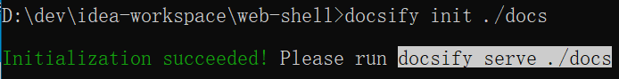
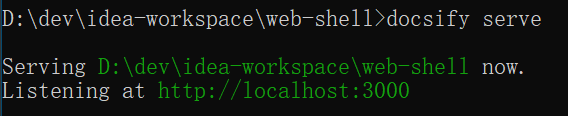

### docsify：一个神奇的文档网站生成器。 [官网](https://docsify.js.org/#/zh-cn/)
- docsify 可以快速帮你生成文档网站。不同于 GitBook、Hexo 的地方是它不会生成静态的 .html 文件，所有转换工作都是在运行时。如果你想要开始使用它，只需要创建一个 index.html 就可以开始编写文档并直接部署在 GitHub Pages。

### 全局安装 docsify-cli 工具，可以方便地创建及在本地预览生成的文档。
```shell
# 需要nodejs环境，下载安装即可：https://nodejs.org/zh-cn/download/
# node.js 设置淘宝镜像加速
npm config set registry "https://registry.npm.taobao.org" 
npm i docsify-cli -g
```


### 初始化项目
```shell
docsify init ./docs
```


### 本地预览网站 提供 LiveReload 功能，可以实时的预览。
```shell
docsify serve ./docs
```


### 开始写文档，初始化成功后，可以看到 ./docs 目录下创建的几个文件
- index.html 入口文件
- README.md 会做为主页内容渲染
- .nojekyll 用于阻止 GitHub Pages 忽略掉下划线开头的文件

我选择直接复制到 **learnotes** 根目录下(本仓库主要是文档)
### 进入github网站某个项目的`settings > pages`页面，选择一个主题，选择一个分支(不选会默认生成一个`gh-pages`分支，而且这个分支是`orphan`分支，单独一个仓库)


- 如果直接合并到master会报错：`Could Not Merge gh-pages: refusing to merge unrelated histories`
- 解决办法：`git pull origin master –allow-unrelated-histories`
- [Git常用命令速查手册](/Git/git-command/README.md)


### 切换到`gh-pages`分支，在项目根目录下
- 新建 `_coverpage.md` 自定义封面页

```

# learnotes
- Java全栈开发学习笔记，面试突击宝典，主要记录平时学习的技术和项目中遇到的问题，微信公众号 [**zmzhou-star**](https://gitee.com/zmzhou-star/learnotes/raw/master/docs/wechat-zmzhou-star.png) 同步更新，欢迎关注；笔记内容包含但不限于Java，Spring，Springboot，SpringCloud，Linux，Vue，数据库，小程序，Android + H5，Git，计算机网络，操作系统，计算机组成原理等如果笔记对您有帮助的话，欢迎star支持，开源不易，请多鼓励！非常感谢~！
<a href="https://gitee.com/zmzhou-star/learnotes/stargazers" target="_blank">
    
</a>
<a href="https://gitee.com/zmzhou-star/learnotes/members" target="_blank">
    
</a>
<a href="https://github.com/zmzhou-star/learnotes/stargazers" target="_blank" rel="noopener">
    
</a>
<a href="https://github.com/zmzhou-star/learnotes/members" target="_blank" rel="noopener">
    
</a>

[Gitee](<https://gitee.com/zmzhou-star/learnotes>)
[Github](<https://github.com/zmzhou-star/learnotes>)
[开始学习](README.md)
```

- 新建 `_navbar.md` 自定义导航栏

```
- [Gitee](https://gitee.com/zmzhou-star/learnotes)
- [Github](https://github.com/zmzhou-star/learnotes)
- [笔记文档](https://zmzhou-star.github.io/learnotes/)
- [公众号`zmzhou-star`](https://gitee.com/zmzhou-star/learnotes/raw/master/docs/wechat-zmzhou-star.png)
```

- 新建 `_sidebar.md` 自定义侧边栏

```
- [**Java全栈开发学习笔记**](README.md)
- **Java程序员ZZM**
  - [设置Redis开机启动](https://mp.weixin.qq.com/s/9DVvr-tfsnhe5EU60Ys2Uw)
  - [Linux安装Redis，Windows安装Redis](https://mp.weixin.qq.com/s/wMD7JsW7nO9MNAfLoS3goQ)
  - [Keepalived + Nginx 实现高可用 Web 负载均衡](https://mp.weixin.qq.com/s/mb2Dpd5iKTkvZd22YoXegQ)
  - [Linux，Windows安装Nginx](https://mp.weixin.qq.com/s/x7JktQH3RIzGeRTQts7Xxg)
  - [设置Nginx开机启动](https://mp.weixin.qq.com/s/EZWVZo5tTXpuUxIjEGXf_A)
  - [Sentinel-dashboard的流控配置持久化到Nacos](https://mp.weixin.qq.com/s/J1pBh1gpqmKqKD0qYdkclg)
  - [Nacos安装](https://mp.weixin.qq.com/s/duFTZTsnR1CHfn5OUFzFuw)
  - [tomcat+redis+Redisson实现session共享](https://mp.weixin.qq.com/s/KCxxRyAEusIQ3paTKw2eiw)
- Redis
  - [设置Redis开机启动](Redis/设置Redis开机启动/README.md)
  - [Linux安装Redis，Windows安装Redis](Redis/Redis安装/README.md)
- Linux
  - [Keepalived + Nginx 实现高可用 Web 负载均衡](Linux/Keepalived%20+%20Nginx%20实现高可用%20Web%20负载均衡/README.md)
  - [Linux，Windows安装Nginx](Linux/Nginx安装/README.md)
  - [设置Nginx开机启动](Linux/设置Nginx开机启动/README.md)
  - [Sentinel-dashboard的流控配置持久化到Nacos](Linux/Sentinel-dashboard的流量控制配置持久化到Nacos-推模式/README.md)
  - [Nacos安装](Linux/Nacos安装/README.md)
  - [tomcat+redis+Redisson实现session共享](Linux/tomcat+redis+Redisson实现session共享/README.md)
```

- 修改 `index.html` 如下

```html
<!DOCTYPE html>
<html lang="en">
<head>
    <meta charset="UTF-8">
    <title>Java全栈开发学习笔记 | zmzhou-star | learnotes</title>
    <link rel="shortcut icon" href="./docs/favicon.ico"/>
    <meta http-equiv="X-UA-Compatible" content="IE=edge,chrome=1"/>
    <meta name="description" content="Description">
    <meta name="viewport" content="width=device-width, user-scalable=no, initial-scale=1.0, maximum-scale=1.0, minimum-scale=1.0">
    <link rel="stylesheet" href="//cdn.jsdelivr.net/npm/docsify/themes/vue.css">
    <!-- 黑暗主题，可选的有 buble，dark，dolphin，pure -->
    <!--<link rel="stylesheet" href="//cdn.jsdelivr.net/npm/docsify/lib/themes/dark.css">-->
</head>
<body>
<div id="app"></div>
<script>
    window.$docsify = {
        name: '<span>learnotes</span>',
        disqus: 'learnotes',
        logo: '/docs/favicon.ico',
        repo: 'https://github.com/zmzhou-star/learnotes/',
        coverpage: '_coverpage.md', // 设置封面
        onlyCover: true, // 只显示封面
        loadSidebar: '_sidebar.md', // 设置侧边栏
        autoHeader: true,
        loadNavbar: '_navbar.md', // 设置导航栏
        auto2top: true, //切换页面后是否自动跳转到页面顶部
        subMaxLevel: 3, //侧边栏显示当前页面的目录(标题)
        // 搜索配置参数
        search: {
            placeholder: '搜索关键字', // 搜索提示框文字， 支持本地化，例子在下面
            noData: '找不到结果!',
            depth: 3,                // 搜索标题的最大程级, 1 - 6
        },
        count:{
          countable:true,
          fontsize:'0.9em',
          color:'rgb(90,90,90)',
          language:'chinese'
        }
    }
</script>
<script src="//cdn.jsdelivr.net/npm/docsify/lib/docsify.min.js"></script>
<!-- 引入搜索模块 -->
<script src="//cdn.jsdelivr.net/npm/docsify/lib/plugins/search.min.js"></script>
<!--Medium's 风格的图片缩放插件-->
<script src="//cdn.jsdelivr.net/npm/docsify/lib/plugins/zoom-image.min.js"></script>
<!--Disqus评论系统支持-->
<script src="//cdn.jsdelivr.net/npm/docsify/lib/plugins/disqus.min.js"></script>
<!-- 添加一键拷贝代码-->
<script src="//cdn.jsdelivr.net/npm/docsify-copy-code"></script>
<!--docsify的分页导航插件-->
<script src="//cdn.jsdelivr.net/npm/docsify-pagination/dist/docsify-pagination.min.js"></script>
<!--文字统计的插件-->
<script src="//unpkg.com/docsify-count/dist/countable.js"></script>
<!-- 添加代码高亮 -->
<script src="//cdn.jsdelivr.net/npm/prismjs@1/components/prism-bash.min.js"></script>
<script src="//cdn.jsdelivr.net/npm/prismjs@1/components/prism-java.min.js"></script>
<script src="//cdn.jsdelivr.net/npm/prismjs@1/components/prism-sql.min.js"></script>
<script src="//cdn.jsdelivr.net/npm/prismjs@1/components/prism-vim.min.js"></script>
<script src="//cdn.jsdelivr.net/npm/prismjs@1/components/prism-yaml.min.js"></script>
</body>
</html>
```

### 提交代码
```shell
$ git add .
$ git commit -m "GitHub-pages文档网站配置"
$ git push origin master
```
### 访问：[https://zmzhou-star.github.io/learnotes](https://zmzhou-star.github.io/learnotes) 一个文档网站已经搞定啦，接下来就可以专注写文档了


