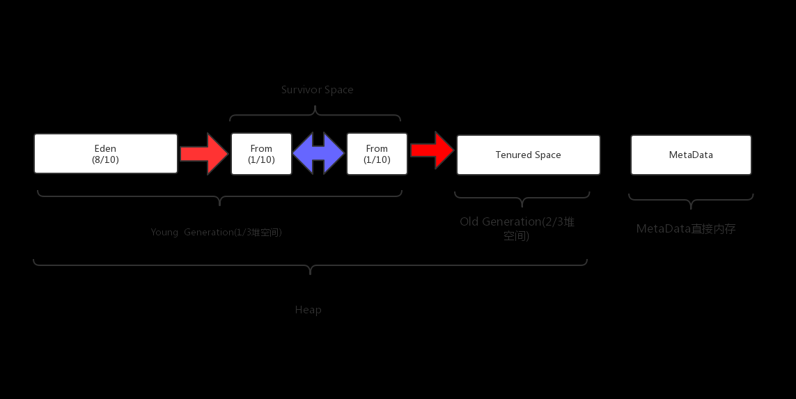
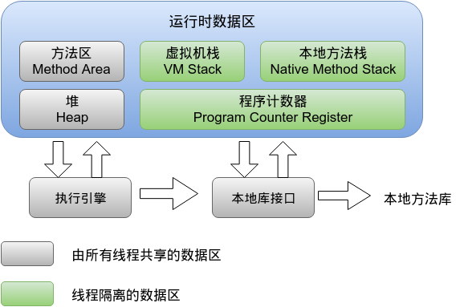
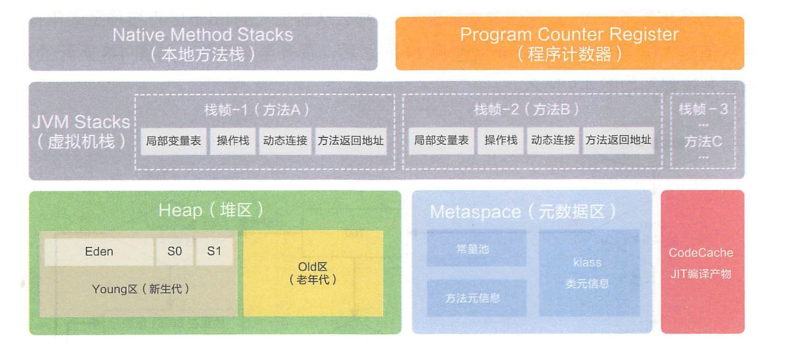

### JVM内存模型架构图





### JVM参数配置方式
参照服务器配置，对 JVM 进行参数优化。
- 在 **bin/catalina.sh** 中修改 **JAVA_OPTS** 参数
- 在 **bin/setenv.sh** 中修改 **JAVA_OPTS** 参数和 **CATALINA_OPTS**

### JDK1.7(现在很少用1.7版本)
```shell
JAVA_OPTS="-Djava.awt.headless=true -Dfile.encoding=UTF-8 -server -Xms512m -Xmx1024m -XX:NewSize=512m -XX:MaxNewSize=1024M -XX:PermSize=1024m -XX:MaxPermSize=1024m -XX:+DisableExplicitGC"
```

### JDK1.8
```shell
JAVA_OPTS="-Djava.awt.headless=true -Dfile.encoding=UTF-8 -server -Xms1024m -Xmx1024m -XX:NewSize=512m -XX:MaxNewSize=1024M -XX:+DisableExplicitGC"
```
1.8 版本中已经没有 PermSize、MaxPermSize。

JAVA8 里对 metaspace 可以在小范围自动扩展永生代避免溢出。

#### JDK 配置的参数说明。
- **-Djava.awt.headless**：没有设备、键盘或鼠标的模式。
- **-Dfile.encoding**：设置字符集，通常使用 **UTF-8**
- **-server**：jvm的server工作模式，对应的有client工作模式。使用“java -version”可以查看当前工作模式
- **-Xms1024m**：初始Heap大小，使用的最小内存
- **-Xmx1024m**：Java heap最大值，使用的最大内存。经验: 设置Xms大小等于Xmx大小
- **-XX:NewSize=512m**：表示新生代初始内存的大小，应该小于 -Xms的值
- **-XX:MaxNewSize=1024M**：表示新生代可被分配的内存的最大上限，应该小于 -Xmx的值
- **-XX:PermSize=1024m**：设定内存的永久保存区域,内存的永久保存区域，VM 存放Class 和 Meta 信息，JVM在运行期间不会清除该区域

> 程序加载很多class情况下，超出PermSize情况下：
> JDK1.7会抛出java.lang.OutOfMemoryError: PermGen space异常 
> JDK1.8下会抛出 ERROR: java.lang.OutOfMemoryError: Metadata space 异常

- **-XX:MaxPermSize=1024m**：设定最大内存的永久保存区域。经验: 设置PermSize大小等于MaxPermSize大小
- **-XX:+DisableExplicitGC**：自动将System.gc() 调用转换成一个空操作，即应用中调用System.gc()会变成一个空操作，避免程序员在代码里进行System.gc()这种危险操作。System.gc() 除非是到了万不得也的情况下使用，都应该交给 JVM。

#### 其他优化参数
- **-XX:SurvivorRatio=2**：年轻代中Eden区与Survivor区的大小比值
- **-XX:ReservedCodeCacheSize=256m**：保留代码占用的内存容量，无大的影响
- **-Xss1024k**：单个线程堆栈大小值，减少这个值可以生成更多线程，操作系统对于一个进程内的线程数是有限制的，经验值在3000-5000左右
- **-XX:+CMSParallelRemarkEnabled**：CMS 垃圾回收算法，对响应时间的重要性需求 大于 对吞吐量的要求，能够承受垃圾回收线程和应用线程共享处理器资源，并且应用中存在比较多的长生命周期的对象的应用
- **-XX:+UseCMSCompactAtFullCollection**：在使用concurrent gc 的情况下, 防止 memoryfragmention, 对live object 进行整理, 使 memory 碎片减少。
- **-XX:+UseCMSInitiatingOccupancyOnly**：在FULL GC的时候， 对年老代的压缩。CMS是不会移动内存的， 因此这个非常容易产生碎片， 导致内存不够用， 因此， 内存的压缩这个时候就会被启用。增加这个参数是个好习惯。可能会影响性能,但是可以消除碎片。
- **-XX:CMSInitiatingOccupancyFraction=60**：使用cms作为垃圾回收, 使用60％后开始CMS收集
- **-XX:+UseGCOverheadLimit**：用来限制使用内存，如果不做控制，可能会报出 java.lang.OutOfMemoryError: GC overhead limit exceeded
- **-XX:+UseConcMarkSweepGC**：使用CMS内存收集
- **-XX:+UseParNewGC**：设置年轻代为并行收集
- **-XX:+HeapDumpOnOutOfMemoryError -XX:HeapDumpPath=/xxx/dump_tomcat.hprof**：JVM会在遇到OutOfMemoryError时拍摄一个“堆转储快照”，并将其保存在一个文件中。
- **-Xloggc:/xxx/gc_tomcat.log**：gc的日志，如果该日志中出现频繁的Full GC就是有相关的系统问题，如果很少，说明暂时还算正常
- **-XX:+PrintGCDateStamps**：输出GC的时间戳（以基准时间的形式）
- **-XX:+PrintGCDetails**：输出GC的日志格式
- **-Dnetworkaddress.cache.ttl=60** 和 **-Dsun.net.inetaddr.ttl=60**：设置DNS缓存时间
- **-DautoStartup=false** 和 **-Dsun.net.client.defaultConnectTimeout=60000**：连接建立超时时间
- **-Dsun.net.client.defaultReadTimeout=60000**：内容获取超时设置
- **-Djmagick.systemclassloader=no**：是否生成缩略图的一个框架的配置

#### 最佳实践参考
- `vim bin/catalina.sh`
```shell
export JAVA_OPTS="-server -Dfile.encoding=UTF-8 -showversion -Xms2000m -Xmx2000m -Xmn500m -XX:PermSize=256m -XX:MaxPermSize=256m \
  -XX:SurvivorRatio=2 -XX:ReservedCodeCacheSize=256m -Xss1024k -Djava.awt.headless=true -XX:+CMSParallelRemarkEnabled \ 
  -XX:+UseCMSCompactAtFullCollection -XX:+UseCMSInitiatingOccupancyOnly -XX:CMSInitiatingOccupancyFraction=60 \ 
  -XX:+UseGCOverheadLimit -XX:+UseConcMarkSweepGC -XX:+UseParNewGC -XX:+HeapDumpOnOutOfMemoryError \ 
  -XX:HeapDumpPath=/tomcat_path/logs/dump_tomcat.hprof -Xloggc:/tomcat_path/logs/gc_tomcat.log -XX:+PrintGCDateStamps \ 
  -XX:+PrintGCDetails -Dnetworkaddress.cache.ttl=60 -Dsun.net.inetaddr.ttl=60 -DautoStartup=false \ 
  -Dsun.net.client.defaultConnectTimeout=60000 -Dsun.net.client.defaultReadTimeout=60000 -Djmagick.systemclassloader=no \ 
  -Djava.security.egd=file:/dev/./urandom"
```
- `vim bin/setenv.sh`
```shell
#!/bin/sh
export CATALINA_OPTS="$CATALINA_OPTS -XX:+PrintGCDetails"
export CATALINA_OPTS="$CATALINA_OPTS -XX:+PrintGCTimeStamps"
export CATALINA_OPTS="$CATALINA_OPTS -XX:+PrintGCDateStamps"
export CATALINA_OPTS="$CATALINA_OPTS -Xloggc:logs/tomcat.gc.log"
export CATALINA_OPTS="$CATALINA_OPTS -XX:+UseConcMarkSweepGC"
export CATALINA_OPTS="$CATALINA_OPTS -XX:+UseCMSCompactAtFullCollection"
export CATALINA_OPTS="$CATALINA_OPTS -XX:+UseCMSInitiatingOccupancyOnly"
export CATALINA_OPTS="$CATALINA_OPTS -XX:SurvivorRatio=2"
export CATALINA_OPTS="$CATALINA_OPTS -XX:+HeapDumpOnOutOfMemoryError"
export CATALINA_OPTS="$CATALINA_OPTS -XX:HeapDumpPath=logs/tomcat.dump"
export CATALINA_OPTS="$CATALINA_OPTS -Djava.awt.headless=true"
JAVA_OPTS="-Dfile.encoding=UTF-8 -server -Xms1024m -Xmx2048m -XX:NewSize=512m -XX:MaxNewSize=1024m -XX:MetaspaceSize=256m -XX:MaxMetaspaceSize=256m -XX:+DisableExplicitGC"
export JAVA_HOME=/usr/java/jdk1.8.0_202
```
#### 常见JVM异常
- JVM Heap（堆）溢出
  - java.lang.OutOfMemoryError: Java heap space —-JVM Heap（堆）溢出

> JVM 在启动的时候会自动设置 JVM Heap 的值，其初始空间（即-Xms）是物理内存的1/64，最大空间（-Xmx）不可超过物理内存。可以利用 JVM提供的 -Xmn -Xms -Xmx 等选项可进行设置。Heap 的大小是 Young Generation 和 Tenured Generaion 之和。在 JVM 中如果 98％ 的时间是用于 GC，且可用的 Heap size 不足 2％ 的时候将抛出此异常信息。

> 解决方法：手动设置 JVM Heap（堆）的大小。

- PermGen space溢出
  - java.lang.OutOfMemoryError: PermGen space —- PermGen space溢出。

> jdk1.8 抛出 ERROR: java.lang.OutOfMemoryError: Metadata space 异常 PermGen space 的全称是 Permanent Generation space，是指内存的永久保存区域。为什么会内存溢出，这是由于这块内存主要是被 JVM 存放Class 和 Meta 信息的，Class 在被 Load 的时候被放入 PermGen space 区域，它和存放 Instance 的 Heap 区域不同，sun 的 GC 不会在主程序运行期对 PermGen space 进行清理，所以如果你的 APP 会载入很多 CLASS 的话，就很可能出现 PermGen space 溢出。

> 解决方法：手动设置 MaxPermSize 大小

- 栈溢出
  - java.lang.StackOverflowError —- 栈溢出

> 栈溢出了，JVM 依然是采用栈式的虚拟机。函数的调用过程都体现在堆栈和退栈上了。调用构造函数的 “层”太多了，以致于把栈区溢出了。通常来讲，一般栈区远远小于堆区的，因为函数调用过程往往不会多于上千层，而即便每个函数调用需要 1K 的空间（这个大约相当于在一个 C 函数内声明了 256 个 int 类型的变量），那么栈区也不过是需要 1MB 的空间。通常栈的大小是 1－2MB 的。

> 解决方法: 代码中递归也不要递归的层次过多。
