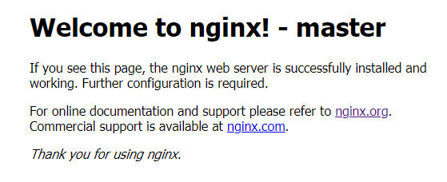
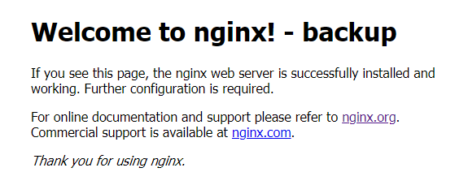

### Keepalived 简要介绍
- Keepalived 是一种高性能的服务器高可用或热备解决方案，Keepalived 可以用来防止服务器单点故障的发生，通过配合 Nginx 可以实现 web 前端服务的高可用。
- Keepalived 以 VRRP 协议为实现基础，用 VRRP 协议来实现高可用性(HA)。 VRRP(Virtual Router Redundancy Protocol) 协议是用于实现路由器冗余的协议， VRRP 协议将两台或多台路由器设备虚拟成一个设备，对外提供虚拟路由器 IP(一个或多个)，而在路由器组内部，如果实际拥有这个对外 IP 的路由器如果工作正常的话就是 MASTER，或者是通过算法选举产生， MASTER 实现针对虚拟路由器 IP 的各种网络功能，如 ARP 请求， ICMP，以及数据的转发等；其他设备不拥有该虚拟 IP，状态是 BACKUP，除了接收 MASTER 的 VRRP 状态通告信息外，不执行对外的网络功能。当主机失效时， BACKUP 将接管原先 MASTER 的网络功能。VRRP 协议使用多播数据来传输 VRRP 数据， VRRP 数据使用特殊的虚拟源 MAC 地址发送数据而不是自身网卡的 MAC 地址， VRRP 运行时只有 MASTER 路由器定时发送 VRRP 通告信息，表示 MASTER 工作正常以及虚拟路由器 IP (组)， BACKUP 只接收 VRRP 数据，不发送数据，如果一定时间内没有接收到 MASTER 的通告信息，各 BACKUP 将宣告自己成为 MASTER，发送通告信息，重新进行 MASTER 选举状态。

- **注意事项**
1. VIP不需要在服务器网络配置文件中配置。
2. nginx主不可用时，需要kill掉nginx主的keepalived服务，这样才可以实现VIP切换，因为主的keepalived优先级高。
3. 故障切换时发送邮件通知由nginx备的keepalived服务来实现。

### 方案规划（主从模式）
|VIP(虚拟IP)|IP|HOSTANME|Nginx端口|默认主从|
| :---: | :---: | :---: | :---: | :---: |
|192.168.163.6|192.168.163.7|zmzhou-7|80|MASTER|
|192.168.163.6|192.168.163.8|zmzhou-8|80|BACKUP|

### Nginx安装
- 下载稳定版nginx：[http://nginx.org/en/download.html](http://nginx.org/en/download.html)
- 安装编译工具及依赖库
`yum -y install gcc gcc-c++ autoconf automake make libtool zlib zlib-devel openssl openssl-devel pcre pcre-devel`
```sh
# wget http://nginx.org/download/nginx-1.20.0.tar.gz
# tar -zxvf nginx-1.20.0.tar.gz
# cd nginx-1.20.0
# ./configure --prefix=/usr/local/nginx --with-http_ssl_module --with-http_stub_status_module --with-http_gzip_static_module --with-stream --with-stream_ssl_module --with-http_realip_module --with-http_flv_module --with-http_mp4_module
# make
# make install
# cd /usr/local/nginx/
# mkdir temp
# sbin/nginx -V
# sbin/nginx
```

### Keepalived安装
1. 下载稳定版keepalived安装 [http://www.keepalived.org/download.html](http://www.keepalived.org/download.html)
```sh
# 安装基础依赖包
yum install -y gcc openssl-devel libnl libnl-devel libnfnetlink-devel net-tools vim
tar -zxvf keepalived-2.2.2.tar.gz
cd keepalived-2.2.2
./configure --prefix=/usr/local/keepalived
make && make install
#将 keepalived 安装成 Linux 系统服务
#安装完成之后，需要做一些工作复制默认配置文件到默认路径
mkdir /etc/keepalived
cp /usr/local/keepalived/etc/keepalived/keepalived.conf /etc/keepalived/
#复制 keepalived 服务启动脚本到默认的地址
cp /usr/local/keepalived/etc/rc.d/init.d/keepalived /etc/init.d/
#复制 keepalived 启动脚本变量引用文件放到/etc/sysconfig/目录下
cp /usr/local/keepalived/etc/sysconfig/keepalived /etc/sysconfig/
#将keepalived主程序软连接到环境变量/usr/sbin/目录下
ln -s /usr/local/sbin/keepalived /usr/sbin/
#设置 keepalived 服务开机启动
chkconfig keepalived on
#启动keepalived
service keepalived start
#停止服务
service keepalived stop
#查看服务状态
service keepalived status
#防火墙要放开vrrp组播包通信
firewall-cmd --direct --permanent --add-rule ipv4 filter INPUT 0 --destination 224.0.0.18 --protocol vrrp -j ACCEPT
firewall-cmd --direct --permanent --add-rule ipv4 filter OUTPUT 0 --destination 224.0.0.18 --protocol vrrp -j ACCEPT
firewall-cmd --reload
```

2. 修改 Keepalived 配置文件
```sh
cd /etc/keepalived
vi keepalived.conf
```
- MASTER节点配置文件
```sh
! Configuration File for keepalived
global_defs {
    ## keepalived 自带的邮件提醒需要开启 sendmail 服务。 建议用独立的监控或第三方 SMTP
    router_id zmzhou-7 ## 标识本节点的字条串，通常为 hostname
    script_user root
    enable_script_security
}
## keepalived 会定时执行脚本并对脚本执行的结果进行分析，动态调整 vrrp_instance 的优先级。如果脚本执行结果为 0，并且 weight 配置的值大于 0，则优先级相应的增加。如果脚本执行结果非 0，并且 weight配置的值小于 0，则优先级相应的减少。其他情况，维持原本配置的优先级，即配置文件中 priority 对应的值。
vrrp_script chk_nginx {
    script "/etc/keepalived/nginx_check.sh" ## 检测 nginx 状态的脚本路径
    interval 2 ## 检测时间间隔
    weight -20 ## 如果条件成立，权重-20
}
## 定义虚拟路由， VI_1 为虚拟路由的标示符，自己定义名称
vrrp_instance VI_1 {
    ## 主节点为 MASTER， 对应的备份节点为 BACKUP
    state MASTER
    interface ens33 ## 绑定虚拟 IP 的网络接口，与本机 IP 地址所在的网络接口相同， 我的是 ens33
    virtual_router_id 7 ## 虚拟路由的 ID 号， 两个节点设置必须一样， 可选 IP 最后一段使用, 相同的 VRID 为一个组，他将决定多播的 MAC 地址
    mcast_src_ip 192.168.163.7 ## 本机 IP 地址
    priority 100 ## 节点优先级， 值范围 0-254， MASTER 要比 BACKUP 高
    nopreempt ## 优先级高的设置 nopreempt 解决异常恢复后再次抢占的问题
    advert_int 1 ## 组播信息发送间隔，两个节点设置必须一样， 默认 1s
    ## 设置验证信息，两个节点必须一致
    authentication {
        auth_type PASS
        ## 验证密码
        auth_pass zmzhou
    }
    ## 将 track_script 块加入 instance 配置块
    track_script {
        ## 执行 Nginx 监控的服务
        chk_nginx
    }
    # 虚拟 IP 池, 两个节点设置必须一样
    virtual_ipaddress {
        192.168.163.6/24 dev ens33 label ens33:1 ## 虚拟 ip，可以定义多个
    }
}
```
- BACKUP节点配置文件
```sh
! Configuration File for keepalived
global_defs {
    router_id zmzhou-8
    script_user root
    enable_script_security
}
vrrp_script chk_nginx {
    script "/etc/keepalived/nginx_check.sh"
    interval 2
    weight -20
}
vrrp_instance VI_1 {
    state BACKUP
    interface ens33
    virtual_router_id 7
    mcast_src_ip 192.168.163.8
    priority 90
    advert_int 1
    authentication {
        auth_type PASS
        auth_pass zmzhou
    }
    track_script {
        chk_nginx
    }
    #节点变为master时执行发送邮件通知脚本
    notify_master /etc/keepalived/send_mail.sh

    virtual_ipaddress {
        192.168.163.6/24 dev ens33 label ens33:1
    }
}
```
3. 编写 Nginx 状态检测脚本(脚本要求：如果 nginx 停止运行，尝试启动，如果无法启动则杀死本机的 keepalived 进程， keepalied将虚拟 ip 绑定到 BACKUP 机器上)
```sh
vi nginx_check.sh
#!/bin/bash
#1.判断Nginx是否存活,如果不存活则尝试启动Nginx
if [ `ps -C nginx --no-header |wc -l` -eq 0 ]; then
   #/usr/local/nginx/sbin/nginx
   systemctl restart nginx
   sleep 2
#2.等待2秒后再次获取一次Nginx状态
   if [ `ps -C nginx --no-header |wc -l` -eq 0 ]; then
#3.再次进行判断, 如Nginx还不存活则停止Keepalived,让地址进行漂移,并退出脚本
      killall keepalived
   fi
fi
# 保存后，给脚本赋执行权限
chmod +x /etc/keepalived/nginx_check.sh
```
4. keepalived故障切换邮件通知（可选）
```sh
yum -y install perl-CPAN
cpan Net::SMTP_auth
vi send_mail.sh
chmod +x /etc/keepalived/send_mail.sh
# send_mail脚本如下：
#!/usr/bin/perl -w
use Net::SMTP_auth;
use strict;
#smtp服务器
my $mailhost = 'smtp.qq.com';
#发送邮件的邮箱
my $mailfrom = 'zmzhou8@qq.com';
#接收邮件的邮箱
my @mailto   = ('zmzhou8@qq.com');
#邮件主题
my $subject  = 'keepalived up on backup';
#邮件正文
my $text = "正文\n nginx-1服务器宕机！nginx-2变为master！！！";
#发送邮件的用户名
my $user   = 'zmzhou8@qq.com';
#发送邮件的邮箱密码
my $passwd = '******';
&SendMail();
############################## 
# Send notice mail 
############################## 
sub SendMail() {
    my $smtp = Net::SMTP_auth->new( $mailhost, Timeout => 120, Debug => 1 )
      or die "Error.\n";
    $smtp->auth( 'LOGIN', $user, $passwd );
    foreach my $mailto (@mailto) {
        $smtp->mail($mailfrom);
        $smtp->to($mailto);
        $smtp->data();
        $smtp->datasend("To: $mailto\n");
        $smtp->datasend("From:$mailfrom\n");
        $smtp->datasend("Subject: $subject\n");
        $smtp->datasend("\n");
        $smtp->datasend("$text\n\n");
        $smtp->dataend();
    }
    $smtp->quit;
}
```
5. Keepalived+Nginx 高可用测试
- 同时启动两台服务器的Nginx和Keepalived，我们通过VIP(192.168.163.6)来访问Nginx，此时应该访问的是192.168.163.7
```sh
#启动keepalived，keepalived会帮我们启动Nginx
service keepalived start
#查看网卡信息(配置成功会含有VIP信息)
ip addr show ens33
```


- 测试关闭nginx服务 keepalived 是否会重启nginx
```sh
service nginx stop
service nginx status
# 会发现nginx依然启动
```
- 关闭 192.168.163.7 上的 keepalived 和 nginx
```sh
service nginx stop
service keepalived stop
```
此时会收到备 keepalived 发送的邮件，再通过VIP(192.168.163.6)访问应该是192.168.163.8



至此，**Keepalived + Nginx 实现高可用 Web 负载均衡**搭建完毕。
