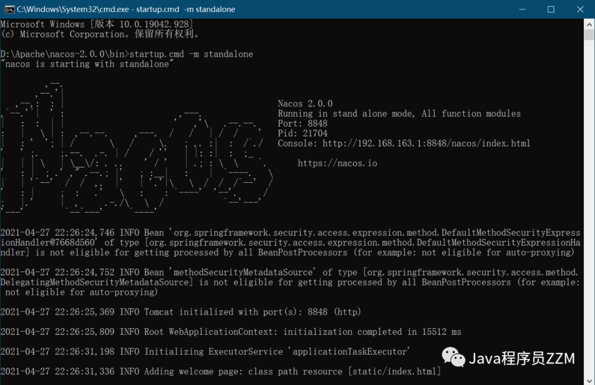
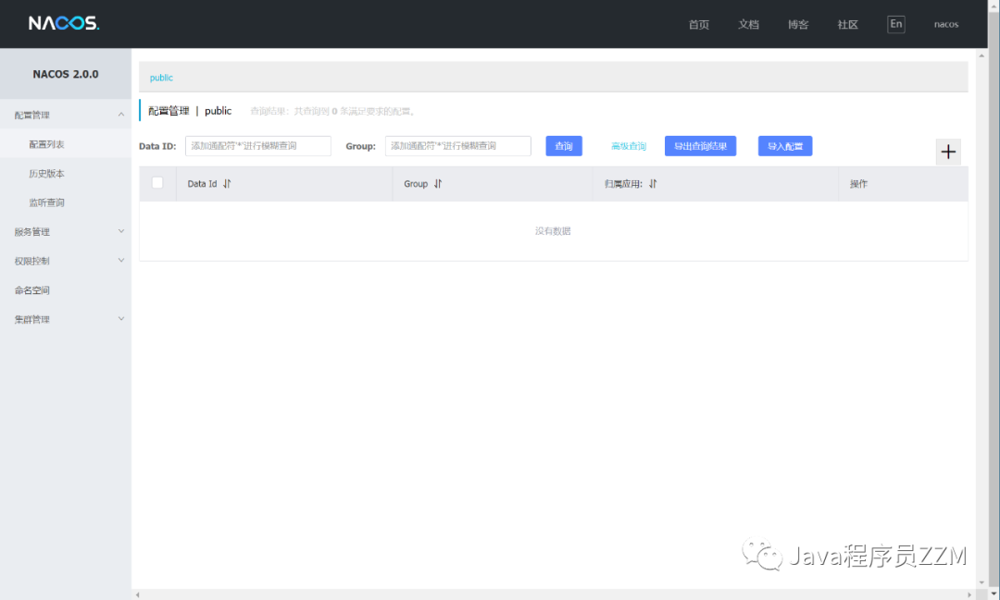

### 从 Github 上下载压缩包
- 当前最新版本为2.0.0：[https://github.com/alibaba/nacos/releases](https://github.com/alibaba/nacos/releases)
### 创建Nacos数据库(目前只支持mysql)

```sql
use mysql;
-- 创建数据库
CREATE DATABASE nacos_config;
-- 创建用户
create user 'nacos'@'localhost' identified by 'Zmzhou.V587';
-- 授权
grant select,insert,update,delete,create on `nacos_config`.* to 'nacos'@'localhost';
-- 或者赋所有权限 grant all privileges on `nacos_config`.* to 'nacos'@'localhost';
-- 查看一下用户列表
select host,user,authentication_string from mysql.user;
-- 刷新权限，立即启用修改
flush privileges;
-- 取消用户所有数据库（表）的所有权限
revoke all on nacos_config.* from 'nacos'@'localhost';
-- 删除用户
delete from mysql.user where user = 'nacos';
-- 删除数据库
drop database nacos_config;
```
### 初始化mysql数据库 nacos_config
- 初始化mysql数据库，数据库初始化文件：conf/nacos-mysql.sql

### 修改 Nacos 配置文件 conf/application.properties 增加mysql数据源配置
```
#*************** Config Module Related Configurations ***************#
### If use MySQL as datasource:
spring.datasource.platform=mysql
### Count of DB:
db.num=1
### Connect URL of DB:
db.url.0=jdbc:mysql://127.0.0.1:3306/nacos_config?characterEncoding=utf8&connectTimeout=1000&socketTimeout=3000&autoReconnect=true&useUnicode=true&useSSL=true&serverTimezone=GMT%2B8
db.user=nacos
db.password=Zmzhou.V587
```
### 单机模式下运行Nacos
- Windows `nacos/bin` 目录下打开 **CMD** 执行 `startup.cmd -m standalone`
- Linux `nacos/bin` 目录下执行 `sh startup.sh -m standalone`



- 浏览器输入：http://127.0.0.1:8848/nacos



默认用户名密码是：nacos/nacos
- 参考Nacos官网：[https://nacos.io/zh-cn/docs/deployment.html](https://nacos.io/zh-cn/docs/deployment.html)
