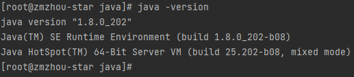
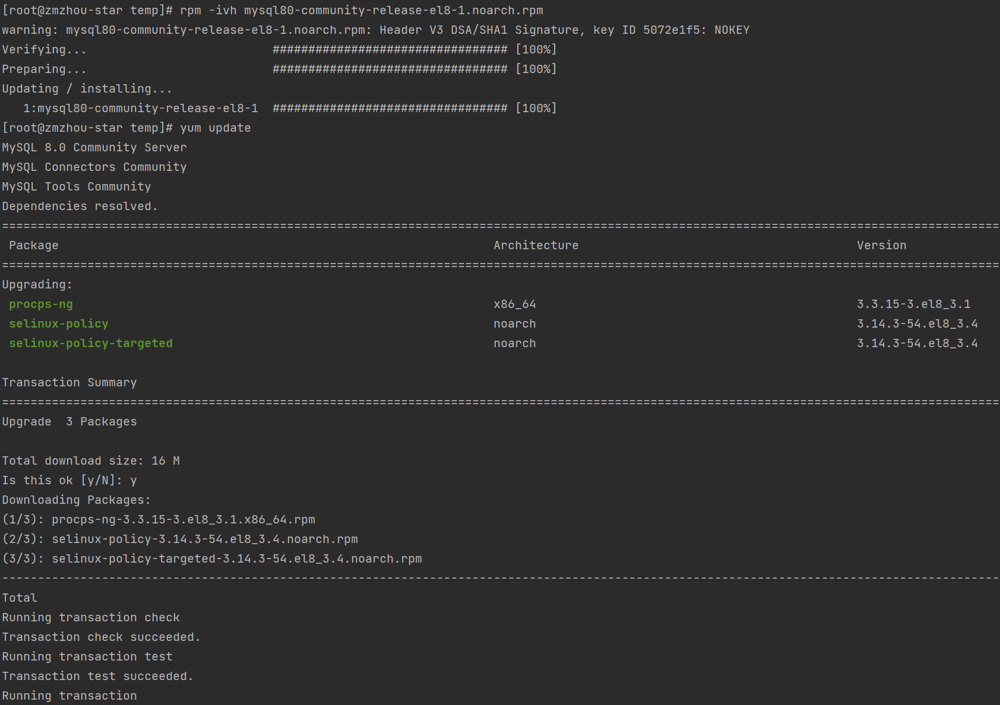
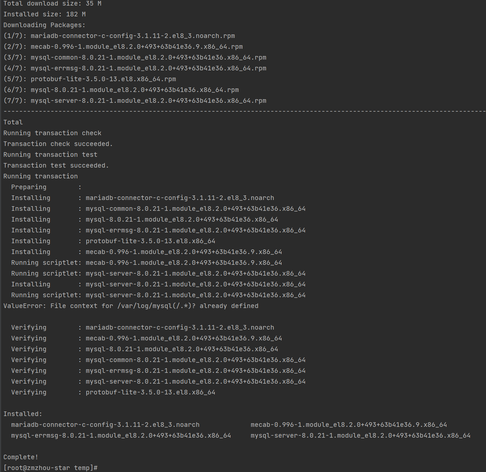
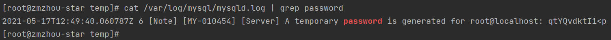
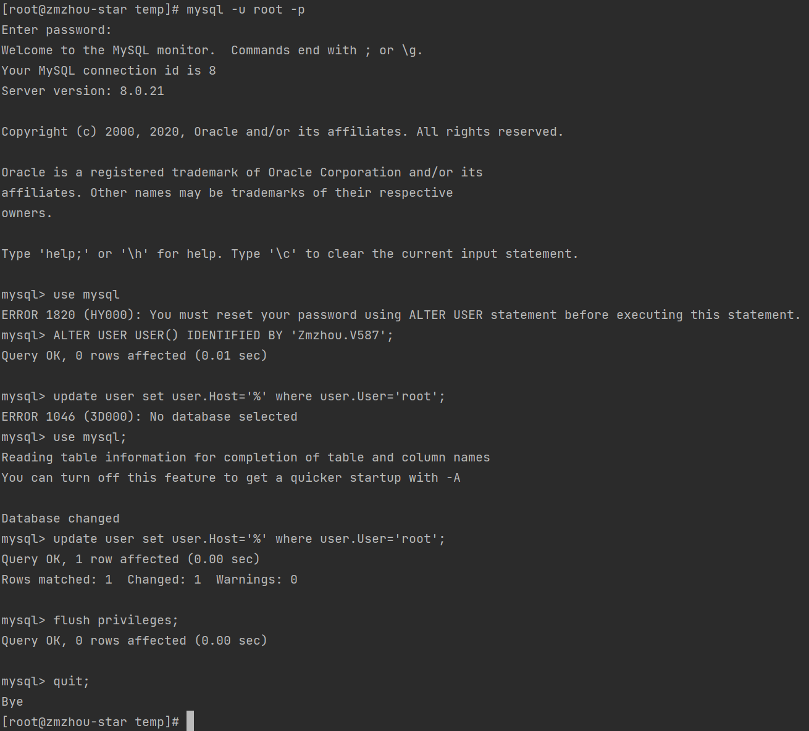

### [安装Nginx](/Linux/Nginx安装/README.md)
- [设置Nginx开机启动](/Linux/设置Nginx开机启动/README.md)

### 安装jdk，配置环境变量
- 下载，上传jdk-8u202-linux-x64.tar.gz
- 解压
```shell
tar -zxvf jdk-8u202-linux-x64.tar.gz -C /usr/java/
```
- 配置环境变量 `vim /etc/profile`
```shell
export JAVA_HOME=/usr/java/jdk1.8.0_202
export JRE_HOME=$JAVA_HOME/jre
export PATH=$PATH:$JAVA_HOME/bin:$JRE_HOME/bin
export CLASSPATH=.:$JAVA_HOME/lib:$JRE_HOME/lib:$JAVA_HOME/lib/dt.jar:$JAVA_HOME/lib/tools.jar
```
- 刷新环境变量 `source /etc/profile`，检查环境变量配置是否正确 `java -version`



### [安装Redis](/Redis/Redis安装/README.md)
- [设置Redis开机启动](/Redis/设置Redis开机启动/README.md)

### 安装 MySQL
- 下载 Yum 资源包 [https://dev.mysql.com/downloads/repo/yum/](https://dev.mysql.com/downloads/repo/yum/)
- 使用 yum 命令安装 MySQL
```shell
rpm -ivh mysql80-community-release-el8-1.noarch.rpm
yum update -y
yum install mysql-server -y
```



- 权限设置：
```shell
chown -R mysql:mysql /var/lib/mysql
chmod -R 777 /var/lib/mysql
```
- 初始化 MySQL：
```shell
mysqld --initialize
```
- 设置开机启动，并启动 MySQL：
```shell
systemctl enable mysqld
systemctl start mysqld
```
- 查看 MySQL 运行状态：
```shell
systemctl status mysqld
```
- 查看MySQL初始密码：
```shell
cat /var/log/mysql/mysqld.log | grep password
#或者
grep 'temporary password' /var/log/mysql/mysqld.log
```


  
- 修改密码，设置允许远程登录
```shell
mysql -u root -p
ALTER USER USER() IDENTIFIED BY 'Zmzhou.V587';
use mysql;
update user set user.Host='%' where user.User='root';
flush privileges;
```


### 部署 easyboot 后台管理系统
- 创建数据库和用户（只需创建数据库和用户，建表语句由flyway管理启动服务会自动执行）
```mysql
use mysql;
-- 创建数据库
CREATE DATABASE easyboot;
-- 创建用户
create user 'easyboot'@'%' identified by 'Zmzhou.V587';
grant select,insert,update,delete,create on `easyboot`.* to 'easyboot'@'%';
-- 查看一下用户列表
select host,user,authentication_string from mysql.user;
-- 刷新权限，立即启用修改
flush privileges;
```
- git clone https://gitee.com/zmzhou-star/easyboot.git
- 修改redis等配置文件
- 打包
```shell
mvn clean install -X -Dmaven.test.skip=true -P prod
```
- 新建Linux后台运行启动脚本 startup.sh
```shell
#!bin/sh
nohup java -jar -server easyboot-1.0.jar > easyboot.out 2>&1 &
```

#### 添加Nginx反向代码配置
```text
location /eboot {
    proxy_pass http://127.0.0.1:8089/eboot;
}
error_page  404              /404.html;
location = /404.html {
# 放错误页面的目录路径。
    root   html;
}
```