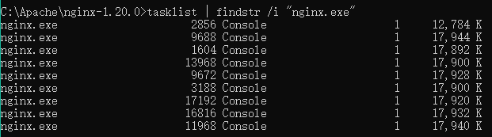

### Linux 源码安装Nginx
- 下载稳定版nginx：[http://nginx.org/en/download.html](http://nginx.org/en/download.html)
- 安装编译工具及依赖库
`yum -y install gcc gcc-c++ autoconf automake make libtool zlib zlib-devel openssl openssl-devel pcre pcre-devel`
- 说明：
    - PCRE(Perl Compatible Regular Expressions)是一个Perl库，包括 perl 兼容的正则表达式库。nginx的http模块使用pcre来解析正则表达式，所以需要在linux上安装pcre库
    注：pcre-devel是使用pcre开发的一个二次开发库。nginx也需要此库。
    - zlib库提供了很多种压缩和解压缩的方式，nginx使用zlib对http包的内容进行gzip，所以需要在linux上安装zlib库。
    - OpenSSL 是一个强大的安全套接字层密码库，囊括主要的密码算法、常用的密钥和证书封装管理功能及SSL协议，并提供丰富的应用程序供测试或其它目的使用。nginx不仅支持http协议，还支持https（即在ssl协议上传输http），所以需要在linux安装openssl库。
```sh
# wget http://nginx.org/download/nginx-1.20.0.tar.gz
# tar -zxvf nginx-1.20.0.tar.gz
# cd nginx-1.20.0
# ./configure --prefix=/usr/local/nginx --with-http_ssl_module --with-http_stub_status_module --with-http_gzip_static_module --with-stream --with-stream_ssl_module  --with-http_realip_module --with-http_flv_module --with-http_mp4_module
# make
# make install
# cd /usr/local/nginx/
# mkdir temp
# sbin/nginx -V
# sbin/nginx
```

- [设置Nginx开机启动](/Linux/设置Nginx开机启动/README.md)
- 查看nginx服务状态：`service nginx status`


### Windows 压缩包安装Nginx
- 下载Windows最新稳定版nginx
1. 解压后在 nginx-1.20.0 目录下新建启动，重启，关闭脚本
- 新建 startup.bat
```bat
@echo off
title "startup nginx"
echo "nginx is starting on port 80"
start "" "nginx.exe"
rem 等待5秒后退出
CHOICE /T 5 /C ync /CS /D y /n
exit
```
- 新建 restart.bat
```bat
@echo off
title "restart nginx"
tasklist | findstr /i "nginx.exe"
echo "nginx is running, stopping..."
tskill nginx
echo "stop nginx"
nginx.exe -t
nginx.exe -v
start nginx.exe
echo "nginx is starting on port 80"
rem 等待3秒后退出
rem CHOICE /T 3 /C ync /CS /D y /n
timeout /nobreak /t 3
exit
```
- 新建 shutdown.bat
```bat
@echo off
title "stop nginx"
tasklist | findstr /i "nginx.exe"
echo "nginx is running, stopping..."
TASKKILL /F /IM nginx.exe /T
echo "nginx is shutdown."
```
- 查看nginx服务状态：`tasklist | findstr /i "nginx.exe"`


### Nginx 参考配置
```sh
#user  nobody;
worker_processes  auto;
#配置Nginx worker进程最大打开文件数
worker_rlimit_nofile 65535;
#error_log  logs/error.log;
#error_log  logs/error.log  notice;
#error_log  logs/error.log  info;
#pid        logs/nginx.pid;
events {
    # Linux下多路复用IO接口select/poll的增强版本，使用epoll模式，增加nginx系统并发连接能力
    use epoll;
    multi_accept on;
    worker_connections 20480;
    #「惊群问题」当一个新连接到达时，如果激活了accept_mutex，那么多个Worker将以串行方式来处理，其中有一个Worker会被唤醒，其他的Worker继续保持休眠状态；
    # 如果没有激活accept_mutex，那么所有的Worker都会被唤醒，不过只有一个Worker能获取新连接，其它的Worker会重新进入休眠状态
    accept_mutex on;
}
http {
    include       mime.types;
    default_type  application/octet-stream;
    # 隐藏版本号的作用：通过你所用的版本，找其漏洞，进行攻击
    server_tokens off;
    add_header X-Frame-Options SAMEORIGIN;
    # on为启用，off为关闭
    gzip  on;
    # Nginx的动态压缩是对每个请求先压缩再输出，这样造成虚拟机浪费了很多cpu，解决这个问题可以利用nginx模块Gzip Precompression，这个模块的作用是对于需要压缩的文件，直接读取已经压缩好的文件(文件名为加.gz)，而不是动态压缩，对于不支持gzip的请求则读取原文件
    gzip_static on;
    # 设置允许压缩的页面最小字节数，页面字节数从header头中的Content-Length中进行获取。默认值是0，不管页面多大都压缩。建议设置成大于1k的字节数，小于1k可能会越压越大。
    gzip_min_length 1k;
    # 获取多少内存用于缓存压缩结果，‘4 32K’表示以32K*4为单位获得
    gzip_buffers 4 32K;
    # 识别http协议的版本,早起浏览器可能不支持gzip自解压,用户会看到乱码
    gzip_http_version 1.1;
    # gzip压缩比（1~9），越小压缩效果越差，但是越大处理越慢，所以一般取中间值;
    gzip_comp_level 5;
    # 对特定的MIME类型生效,其中'text/html’被系统强制启用
    gzip_types text/plain application/x-javascript text/css application/xml application/javascript;
    # 启用应答头"Vary: Accept-Encoding"
    gzip_vary on;
    # IE5.5和IE6 SP1使用msie6参数来禁止gzip压缩 )指定哪些不需要gzip压缩的浏览器(将和User-Agents进行匹配),依赖于PCRE库
    gzip_disable "MSIE [1-6].";
    #配置代理参数
    proxy_redirect off;
    proxy_set_header Host $host;
    proxy_set_header X-Real-IP $remote_addr;
    proxy_set_header X-Forwarded-For $proxy_add_x_forwarded_for;
    client_max_body_size 10m;
    client_body_buffer_size 128k;
    proxy_connect_timeout 10;
    proxy_send_timeout 65;
    proxy_read_timeout 65;
    proxy_buffer_size 4k;
    proxy_buffers 4 32k;
    proxy_busy_buffers_size 64k;
    #缓存配置
    proxy_cache_key '$host:$server_port$request_uri';
    proxy_temp_file_write_size 64m;
    proxy_temp_path temp/proxy_temp_path;
    proxy_cache_path temp/proxy_cache_path levels=1:2 keys_zone=cache_one:200m inactive=5d max_size=1g;
    proxy_ignore_headers X-Accel-Expires Expires Cache-Control Set-Cookie;
    #FastCGI优点是把动态语言解析和HTTP服务器分离开来
    #针对504错误修改参数
    send_timeout 60;
    fastcgi_buffers 8 128k;
    fastcgi_buffer_size 128k;
    fastcgi_busy_buffers_size 256k;
    fastcgi_temp_file_write_size 256k;
    #针对504错误 增加超时时间
    fastcgi_connect_timeout 120;
    fastcgi_send_timeout 120;
    fastcgi_read_timeout  120;
    #从哪个header头检索出所要的IP地址
    real_ip_header X-Forwarded-For;
    #真实服务器上一级代理的IP地址或者IP段,可以写多行
    set_real_ip_from 0.0.0.0/0;
    #递归的去除所配置中的可信IP。排除set_real_ip_from里面出现的IP。如果出现了未出现这些IP段的IP，那么这个IP将被认为是用户的IP。
    real_ip_recursive on;
    #log_format  main  '$remote_addr - $remote_user [$time_local] "$request" '
    #                  '$status $body_bytes_sent "$http_referer" '
    #                  '"$http_user_agent" "$http_x_forwarded_for"';
    #access_log  logs/access.log  main;
    sendfile        on;
    tcp_nopush      on;
    tcp_nodelay     on;
    #keepalive_timeout  0;
    keepalive_timeout  65;
    #gzip  on;
    server {
        listen       80;
        server_name  localhost;
        #charset koi8-r;
        #access_log  logs/host.access.log  main;
        location / {
            root   html;
            index  index.html index.htm;
            #try_files $uri $uri/ /index.html;
        }
        #location = / {
        #  rewrite ^/(.*)$ https://www.baidu.com/$1 break;
        #}
        # 查看Nginx的一些状态信息
        location /status {
            stub_status;
        }
        location /eboot {
            proxy_pass http://127.0.0.1:8089/eboot;
        }
        error_page  404              /404.html;
        location = /404.html {
           # 放错误页面的目录路径。
           root   html;
        }
        # redirect server error pages to the static page /50x.html
        #
        error_page   500 502 503 504  /50x.html;
        location = /50x.html {
            root   html;
        }
        # proxy the PHP scripts to Apache listening on 127.0.0.1:80
        #
        #location ~ \.php$ {
        #    proxy_pass   http://127.0.0.1;
        #}
        # pass the PHP scripts to FastCGI server listening on 127.0.0.1:9000
        #
        #location ~ \.php$ {
        #    root           html;
        #    fastcgi_pass   127.0.0.1:9000;
        #    fastcgi_index  index.php;
        #    fastcgi_param  SCRIPT_FILENAME  /scripts$fastcgi_script_name;
        #    include        fastcgi_params;
        #}
        # deny access to .htaccess files, if Apache's document root
        # concurs with nginx's one
        #
        #location ~ /\.ht {
        #    deny  all;
        #}
    }
    # another virtual host using mix of IP-, name-, and port-based configuration
    #
    #server {
    #    listen       8000;
    #    listen       somename:8080;
    #    server_name  somename  alias  another.alias;
    #    location / {
    #        root   html;
    #        index  index.html index.htm;
    #    }
    #}
    # HTTPS server
    #
    #server {
    #    listen       443 ssl;
    #    server_name  localhost;
    #    ssl_certificate      cert.pem;
    #    ssl_certificate_key  cert.key;
    #    ssl_session_cache    shared:SSL:1m;
    #    ssl_session_timeout  5m;
    #    ssl_ciphers  HIGH:!aNULL:!MD5;
    #    ssl_prefer_server_ciphers  on;
    #    location / {
    #        root   html;
    #        index  index.html index.htm;
    #    }
    #}
}
```
