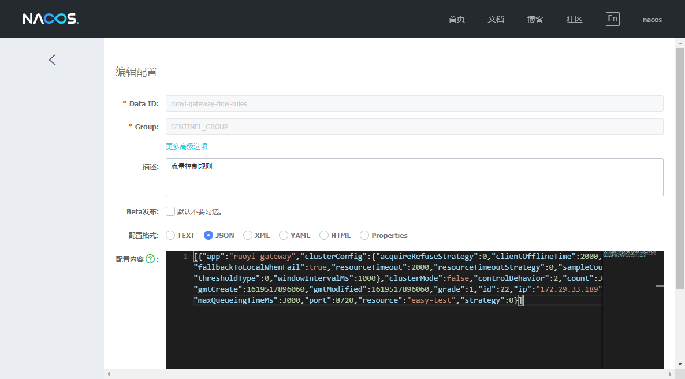

### 下载(Fork)Sentinel源码
- 源码地址：[https://github.com/alibaba/Sentinel](https://github.com/alibaba/Sentinel)
- 我的地址：[https://github.com/zmzhou-star/Sentinel](https://github.com/zmzhou-star/Sentinel)
- Sentinel-dashboard下载地址：[https://github.com/zmzhou-star/Sentinel/releases/tag/1.8.1.2](https://github.com/zmzhou-star/Sentinel/releases/tag/1.8.1.2)

### sentinel-dashboard子模块改造
1. 找到sentinel-dashboard子模块，idea打开
2. 打开pom.xml文件
```
    <!-- for Nacos rule publisher sample -->
    <dependency>
        <groupId>com.alibaba.csp</groupId>
        <artifactId>sentinel-datasource-nacos</artifactId>
        <!-- 注释 test -->
        <!--<scope>test</scope>-->
    </dependency>
    <!-- 可以选择升级 spring boot 版本，升级后需要新增 jackson 依赖 -->
    <dependency>
        <groupId>com.fasterxml.jackson.core</groupId>
        <artifactId>jackson-databind</artifactId>
        <version>2.11.4</version>
    </dependency>
```


3. 找到test下的目录 `sentinel-dashboard/src/test/java/com/alibaba/csp/sentinel/dashboard/rule/nacos` 将整个目录复制到 `sentinel-dashboard/src/main/java/com/alibaba/csp/sentinel/dashboard/rule/nacos`
4. 移动 `NacosConfig` 到 `com/alibaba/csp/sentinel/dashboard/config/NacosConfig.java` 并修改内容如下：
```
@Configuration
public class NacosConfig {
    @Value("${nacos.server-addr:127.0.0.1:8848}")
    private String serverAddr;
    @Bean
    public Converter<List<FlowRuleEntity>, String> flowRuleEntityEncoder() {
        return JSON::toJSONString;
    }
    @Bean
    public Converter<String, List<FlowRuleEntity>> flowRuleEntityDecoder() {
        return s -> JSON.parseArray(s, FlowRuleEntity.class);
    }
    @Bean
    public ConfigService nacosConfigService() throws NacosException {
        return ConfigFactory.createConfigService(serverAddr);
    }
}
```


5. 修改 `sentinel-dashboard/src/main/resources/application.properties` 添加 nacos 地址配置
```
# nacos address
nacos.server-addr=127.0.0.1:8848
```
6. 修改 `sentinel-dashboard/src/main/java/com/alibaba/csp/sentinel/dashboard/controller/v2/FlowControllerV2.java`
```
    @Autowired
    @Qualifier("flowRuleNacosProvider")
    private DynamicRuleProvider<List<FlowRuleEntity>> ruleProvider;
    @Autowired
    @Qualifier("flowRuleNacosPublisher")
    private DynamicRulePublisher<List<FlowRuleEntity>> rulePublisher;
```


7. 修改 `sentinel-dashboard/src/main/webapp/resources/app/scripts/directives/sidebar/sidebar.html` 找到
```
<li ui-sref-active="active" ng-if="entry.appType==0">
<a ui-sref="dashboard.flow({app: entry.app})">
    <i class="glyphicon glyphicon-filter"></i>&nbsp;&nbsp;流控规则 V1</a>
</li>
```
- 解开注释并注释原来的流控规则


- 整个工程的改造文件如下：


8. 微服务bootstrap配置文件改造
- 使用 sentinel-dashboard 默认 **命名后缀规则** 和 **groupId** 


9. 打包
```bash
mvn clean package -Dmaven.test.skip=true
```
10. 运行
找到 `sentinel-dashboard/target/sentinel-dashboard.jar` 打开 CMD 控制台，执行
`java -Dserver.port=8718 -Dcsp.sentinel.dashboard.server=localhost:8718 -Dproject.name=sentinel-dashboard -jar sentinel-dashboard.jar`
11. 编写Windows平台bat脚本
```bat
@echo off
title sentinel-dashboard
java -Dserver.port=8718 -Dcsp.sentinel.dashboard.server=localhost:8718 -Dproject.name=sentinel-dashboard -jar sentinel-dashboard.jar
```
12. 编写Linux平台shell脚本
```sh
#!/bin/sh
java -Dserver.port=8718 -Dcsp.sentinel.dashboard.server=localhost:8718 -Dproject.name=sentinel-dashboard -jar sentinel-dashboard.jar
```
13. 测试
- 在Sentinel控制台 `http://localhost:8718/` 对应应用名>>流控规则V2 新增流控规则，规则会存储到Nacos数据库





- 直接在Nacos控制台 `http://127.0.0.1:8848/nacos` 配置管理>>配置列表 上修改流控规则，刷新Sentinel控制台，规则也会被修改


- 重启Sentinel控制台，重启微服务；刷新控制台，规则依然存在
14. 以上，其实只是实现了流控规则的持久化。Sentinel有若干种规则，例如降级规则、热点规则、系统规则、授权规则等，都需要使用类似的方式，修改 `com.alibaba.csp.sentinel.dashboard.controller` 包中对应的Controller，才能实现持久化。

- 以上微服务代码是学习若依微服务版本：[https://gitee.com/y_project/RuoYi-Cloud](https://gitee.com/y_project/RuoYi-Cloud)

- [设置Redis开机启动](https://mp.weixin.qq.com/s/9DVvr-tfsnhe5EU60Ys2Uw)
- [Linux安装Redis，Windows安装Redis](https://mp.weixin.qq.com/s/wMD7JsW7nO9MNAfLoS3goQ)
- [Keepalived + Nginx 实现高可用 Web 负载均衡](https://mp.weixin.qq.com/s/mb2Dpd5iKTkvZd22YoXegQ)
- [Linux，Windows安装Nginx](https://mp.weixin.qq.com/s/x7JktQH3RIzGeRTQts7Xxg)
- [设置Nginx开机启动](https://mp.weixin.qq.com/s/EZWVZo5tTXpuUxIjEGXf_A)
- [Sentinel-dashboard的流控配置持久化到Nacos](https://mp.weixin.qq.com/s/J1pBh1gpqmKqKD0qYdkclg)
- [Nacos安装](https://mp.weixin.qq.com/s/duFTZTsnR1CHfn5OUFzFuw)
