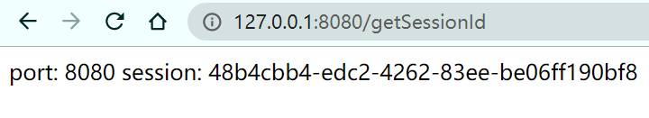
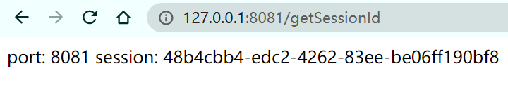
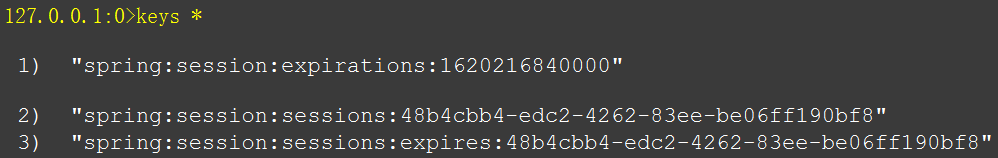

- 先回顾一下 [tomcat+redis+Redisson实现session共享](/Linux/tomcat+redis+Redisson实现session共享/README.md)
- 今天介绍一下spring boot + redis实现session共享
- 应用场景：Nginx负载均衡时session信息共享
1.  pom 需要引入 redis 和 session 的依赖
```xml
<dependency>
    <groupId>org.springframework.boot</groupId>
    <artifactId>spring-boot-starter-data-redis</artifactId>
</dependency>
<dependency>
    <groupId>org.springframework.session</groupId>
    <artifactId>spring-session-data-redis</artifactId>
</dependency>
<dependency>
    <groupId>org.springframework.boot</groupId>
    <artifactId>spring-boot-starter-web</artifactId>
</dependency>
```
2.  application.properties 添加如下配置：
```properties
server.port=8080
# redis配置
spring.redis.host=localhost
spring.redis.port=6379
spring.redis.password=Redis.127
# session存储类型使用redis
spring.session.store-type=redis
```
3.  启动类添加 **@EnableRedisHttpSession** 注解，如下：
```java
import javax.servlet.http.HttpServletRequest;
import org.springframework.boot.SpringApplication;
import org.springframework.boot.autoconfigure.SpringBootApplication;
import org.springframework.session.data.redis.config.annotation.web.http.EnableRedisHttpSession;
import org.springframework.web.bind.annotation.GetMapping;
import org.springframework.web.bind.annotation.RequestMapping;
import org.springframework.web.bind.annotation.RestController;
@EnableRedisHttpSession
@SpringBootApplication
public class RocketmqProducerApplication {
  public static void main(String[] args) {
    SpringApplication.run(RocketmqProducerApplication.class, args);
  }
}
@RestController
@RequestMapping
class TestController {
  @GetMapping("/getSessionId")
  public String getSessionId(HttpServletRequest request) {
    return "port: " + request.getServerPort() + "  session: " + request.getSession().getId();
  }
}
```


从EnableRedisHttpSession注解源码可以看到默认session过期时间是1800秒，同理，我们可以自定义这个时间

4.  测试：启动两个或以上服务，端口分别为8080，8081……
- 分别调用：`http://127.0.0.1:8080/getSessionId`,`http://127.0.0.1:8081/getSessionId`



 
  
sessionId是一样的，redis里也存在同样的session信息，以上，说明session共享已完成。
