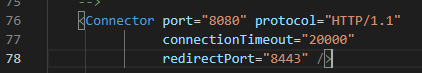

### 前期准备工作
- [Nginx安装](/Linux/Nginx安装/README.md)
- [Redis安装](/Redis/Redis安装/README.md)
- [Tomcat下载](https://tomcat.apache.org/download-90.cgi)
- [作者整理：Tomcat + Redis + Redisson 百度网盘下载](https://pan.baidu.com/s/12vDXvTqWVYn2AYIxTwxq8A) 提取码：5bkj

### 配置Nginx负载均衡
1. 复制两个tomcat，修改端口，一个用8080，另一个用8081，注意第二个要修改sever port




- tomcat 配置优化
```xml
<!-- 此最佳优化配置仅供参考 -->
<Executor name="tomcatThreadPool" namePrefix="catalina-exec-"
    maxThreads="800" minSpareThreads="100"/>
<Connector executor="tomcatThreadPool" port="8080" protocol="org.apache.coyote.http11.Http11Nio2Protocol" 
       connectionTimeout="60000" redirectPort="8443" enableLookups="false" maxPostSize="-1" URIEncoding="UTF-8" 
       acceptCount="1000" disableUploadTimeout="true" maxConnections="10000" SSLEnabled="false"/>
```


2. 修改 `TOMCAT_BASE/webapps/ROOT/index.jsp`，添加：
```html
<table align="center" border="1">
    <tr>
      <td>cluster-desc</td>
        <!-- 分别修改描述 -->
      <td>This is the first tomcat</td>
      <td>This is the second tomcat</td>
    </tr>
    <tr>
      <td>SessionID</td>
      <td><%= request.getSession().getId() %></td>
    </tr>
    <tr>
      <td>SessionCreatedTime</td>
      <td><%= request.getSession().getCreationTime() %></td>
   </tr>
   <tr>
      <td>ServerName</td>
      <td><%=request.getServerName()%></td>
   </tr>
   <tr>
      <td>SessionPort</td>
      <td><%=request.getServerPort()%></td>
   </tr>
</table>
```
3. nginx配置负载均衡组
```
upstream ha-balance {
    server 127.0.0.1:8080 weight=1;
    server 127.0.0.1:8081 weight=1;
}
location = / {
  proxy_pass http://ha-balance;
}
```


4. 测试，访问：`http://127.0.0.1` 发现每次的sessionId都是不一样的


   
### 配置 tomcat session共享
> Add session manager
1. Add shared redisson instance produced by JndiRedissonFactory into **`tomcat/conf/server.xml`** in `GlobalNamingResources` tag area:
```xml
<GlobalNamingResources>
   <Resource name="bean/redisson"
       auth="Container"
       factory="org.redisson.JndiRedissonFactory"
       configPath="${catalina.base}/conf/redisson.yaml"
       closeMethod="shutdown"/>
</GlobalNamingResources>
```
2. Add JndiRedissonSessionManager with resource link to redisson instance into `tomcat/conf/context.xml` in `Context` tag area:
```xml
<Context>
    <ResourceLink name="bean/redisson"
       global="bean/redisson"
       type="org.redisson.api.RedissonClient" />
    <Manager className="org.redisson.tomcat.JndiRedissonSessionManager"
       readMode="REDIS"
       jndiName="bean/redisson" />
</Context>
```
3. 新增redisson配置文件 `tomcat/conf/redisson.yaml` 更多配置可以参考 [https://github.com/redisson/redisson/wiki/2.-Configuration](https://github.com/redisson/redisson/wiki/2.-Configuration)
```yaml
singleServerConfig:
  idleConnectionTimeout: 10000
  connectTimeout: 10000
  timeout: 3000
  retryAttempts: 3
  retryInterval: 1500
  password: null
  subscriptionsPerConnection: 5
  clientName: null
  address: "redis://127.0.0.1:6379"
  subscriptionConnectionMinimumIdleSize: 1
  subscriptionConnectionPoolSize: 50
  connectionMinimumIdleSize: 24
  connectionPoolSize: 64
  database: 0
  dnsMonitoringInterval: 5000
threads: 16
nettyThreads: 32
codec: !<org.redisson.codec.MarshallingCodec> {}
transportMode: "NIO"
```
> Copy two jars into `TOMCAT_BASE/lib` directory:
- github下载地址：[https://github.com/redisson/redisson/tree/master/redisson-tomcat](https://github.com/redisson/redisson/tree/master/redisson-tomcat)
1. redisson-all-3.15.4.jar
2. 根据tomcat版本选择对应的 redisson-tomcat
- Tomcat 7.x - redisson-tomcat-7-3.15.4.jar
- Tomcat 8.x - redisson-tomcat-8-3.15.4.jar
- Tomcat 9.x - redisson-tomcat-9-3.15.4.jar
- Tomcat 10.x - redisson-tomcat-10-3.15.4.jar
>重启tomcat，session共享测试，访问：`http://127.0.0.1/` 发现每次的sessionId都是一样的


