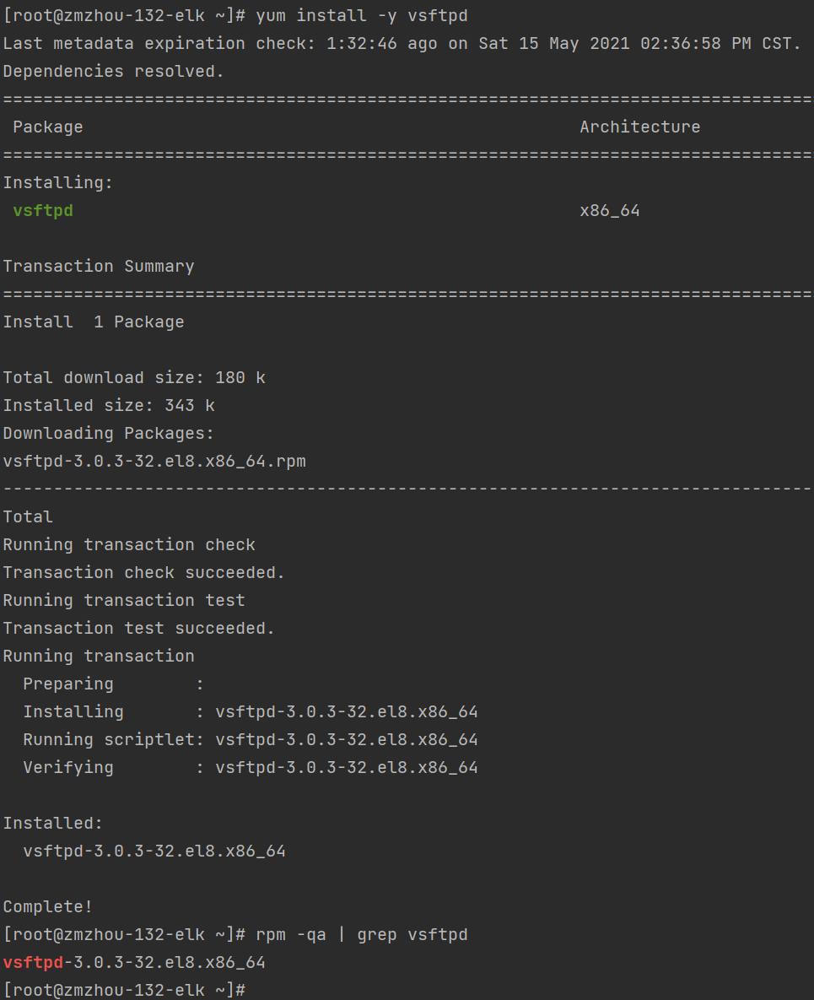

### 安装ftp
1. 检查是否安装了ftp（下图是已安装的效果，没安装是没有展示）
```shell
rpm -qa | grep vsftpd
```


2. 安装 `vsftpd` 服务
```shell
yum install -y vsftpd
```


3. 安装完成后，启动 FTP 服务
```shell
systemctl start vsftpd
```
4. 启动成功后，可以看到系统已经监听了 21 端口
```shell
systemctl status vsftpd
netstat -nltp | grep 21
```


5. 禁用匿名用户
```shell
vim /etc/vsftpd/vsftpd.conf
#yes改为no
anonymous_enable=NO
```
6. 保存后重启
```shell
systemctl restart vsftpd
netstat -nltp | grep 21
```
7. 查看是否开机启动
```shell
systemctl list-unit-files | grep vsftpd
#设置开机启动
chkconfig vsftpd on
systemctl enable vsftpd
```


### 创建用户权限

1. 创建用户，并指定分组和主目录（根据自己的需求设定参数）
```shell
useradd ftpuser
```
- 解析：
  - useradd 添加用户ftpuser
  - -d 指定用户根目录，默认为/home/ftpuser
  - -g 创建指定分组
  - 创建有问题可以删除重新创建 userdel -r ftpuser
  


2. 设置 `ftpuser` 密码
```shell
passwd ftpuser
```
3. 修改ftp配置文件 `/etc/vsftpd/vsftpd.conf` 如下：
```shell
anonymous_enable=NO
local_enable=YES
write_enable=YES
local_umask=022
#anon_upload_enable=YES
dirmessage_enable=YES
xferlog_enable=YES
connect_from_port_20=YES
xferlog_std_format=YES
ascii_upload_enable=YES
ascii_download_enable=YES
#限制用户登录 将用户名添加到/etc/vsftpd/user_list（一个用户一行）来明确指定哪些用户可以登录。
userlist_enable=YES
userlist_deny=NO
userlist_file=/etc/vsftpd/user_list
#FTP 被动模式
pasv_min_port=30000
pasv_max_port=31000
listen=NO
listen_ipv6=YES
pam_service_name=vsftpd
userlist_enable=YES
```

4. 编辑 `vim /etc/vsftpd/user_list` 并增加一行：
```shell
ftpuser
```
或者执行命令：`echo "ftpuser" | sudo tee -a /etc/vsftpd/user_list`

5. 重启FTP服务
```shell
systemctl restart vsftpd
```
6. 打开防火墙
- 打开21端口（FTP 命令端口）,20端口（FTP 数据端口） 和 30000-31000（被动模式端口范围），在你的防火墙中，输入下面的命令：
```shell
sudo firewall-cmd --zone=public --add-port=20-21/tcp --permanent
sudo firewall-cmd --zone=public --add-port=30000-31000/tcp --permanent
#重新加载防火墙规则：
firewall-cmd --reload
```
7. 下载FTP客户端软件 filezilla [https://www.filezilla.cn/download/client](https://www.filezilla.cn/download/client)
- 连接ftp服务器，并测试上传、下载文件


8. 使用 SSL/TLS 加密传输(可选)
- 如果是公网域名服务器，可以选择免费申请一个证书 [https://freessl.cn/](https://freessl.cn/)
- 创建一个2048位的私钥 和 10年有效期的自签名证书。私钥和证书都被保存在同一个文件：
```shell
sudo openssl req -x509 -nodes -days 3650 -newkey rsa:2048 -keyout /etc/vsftpd/vsftpd.pem -out /etc/vsftpd/vsftpd.pem
```
- 修改ftp配置文件 `/etc/vsftpd/vsftpd.conf` 添加如下3行配置：
```shell
rsa_cert_file=/etc/vsftpd/vsftpd.pem
rsa_private_key_file=/etc/vsftpd/vsftpd.pem
ssl_enable=YES
```
- 重启 FTP 服务 `systemctl restart vsftpd`，再次连接时会出现如下弹框：


- 想要更安全，更快速的数据传输，建议使用 SCP 或者 SFTP。
### vsftpd的配置说明，配置文件中限定了vsftpd用户连接控制配置。
- /etc/vsftpd/vsftpd.conf：来自定义用户登录控制、用户权限控制、超时设置、服务器功能选项、服务器性能选项、服务器响应消息等FTP服务器的配置。
- /etc/vsftpd/user_list：该文件里的用户账户在默认情况下也不能访问FTP服务器，仅当vsftpd.conf配置文件里启用userlist_enable=YES选项时才允许访问。**白名单**
- /etc/vsftpd/ftpusers：它指定了哪些用户账户不能访问FTP服务器，例如root等。**黑名单**
- /etc/vsftpd/chroot_list：指定允许使用vsftpd 的用户列表文件。控制名单下的目录能不能离开ftp根目录