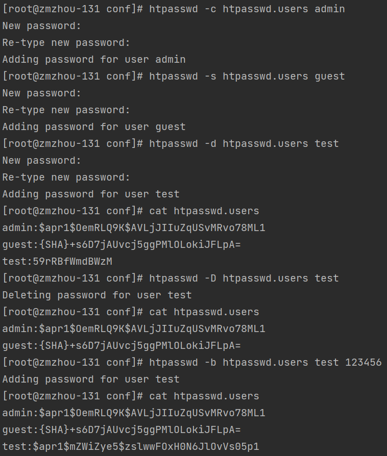

### 安装密码管理器 httpd-tools
```shell
yum install httpd-tools -y
```


### htpasswd创建密码文件
- htpasswd指令创建和更新用于基本认证的用户认证密码文件。htpasswd指令必须对密码文件有读写权限，否则会返回错误码。
- 此命令的适用范围：RedHat、RHEL、Ubuntu、CentOS、Fedora。
- 语法（默认使用md5加密）
  - htpasswd [ -c ]  [ -m ]  [ -D ]  passwdfile username
  - htpasswd -b  [ -c ]  [ -m | -d | -p | -s ] [ -D ]  passwdfile  username  password
  - htpasswd -n  [ -m | -d | -s | -p ]  username
  - htpasswd -nb  [ -m | -d | -s | -p ]  username  password
  
- 参数列表说明

|选项|说明| 
| :---: | :---: |
|-b|使用批处理方式，直接从命令行获取密码，不提示用户输入| 
|-c|创建密码文件，如果文件存在，那么内容被清空重写|
|-n|将加密后的用户名密码结果送到标准输出|
|-m|使用MD5算法加密|
|-d|使用CRYPT算法加密|
|-s|使用SHA算法加密|
|-p|使用文本密码，不加密|
|-D|从认证文件中删除用户记录|

- 操作实例
```shell
cd /usr/local/nginx/conf/
htpasswd -c htpasswd.users admin
htpasswd -s htpasswd.users guest
htpasswd -d htpasswd.users test
htpasswd -D htpasswd.users test
htpasswd -b htpasswd.users test 123456
cat htpasswd.users
htpasswd -nb test 123456
```


### 配置 nginx 反向代理 kibana，并登录验证
- 修改 nginx.conf 配置文件
```text
server{
    listen 80;
    server_name 127.0.0.1 zmzhou-star;
    location / {
        auth_basic           "Please input password";
        auth_basic_user_file /usr/local/nginx/conf/htpasswd.users;
        proxy_pass           http://127.0.0.1:5601;
    }
    error_page  404    /404.html;
    location = /404.html {
        root   /usr/local/nginx/html;
    }
}
```
- 重启 nginx
`systemctl reload nginx`

- 访问 kibana 验证：`http://zmzhou-star/app/discover`


- 输入用户名密码，验证成功！