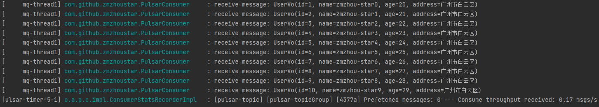

### 简介
- Pulsar 是一个用于服务器到服务器的消息系统，具有多租户、高性能等优势。 Pulsar 最初由 Yahoo 开发，目前由 [Apache 软件基金会](https://www.apache.org/) 管理。
  是 Apache 软件基金会顶级项目，是下一代云原生分布式消息流平台，集消息、存储、轻量化函数式计算为一体，采用计算与存储分离架构设计，支持多租户、持久化存储、多机房跨区域数据复制，具有强一致性、高吞吐、低延时及高可扩展性等流数据存储特性，被看作是云原生时代实时消息流传输、存储和计算最佳解决方案；
- Pulsar 的关键特性如下：
  - Pulsar 的单个实例原生支持多个集群，可跨机房在集群间无缝地完成消息复制。
  - 极低的发布延迟和端到端延迟。
  - 可无缝扩展到超过一百万个 topic。
  - 简单的客户端 API，支持 Java、Go、Python 和 C++。
  - 支持多种 topic 订阅模式（独占订阅、共享订阅、故障转移订阅）。
  - 通过 Apache BookKeeper 提供的持久化消息存储机制保证消息传递 。
    - 由轻量级的 serverless 计算框架 Pulsar Functions 实现流原生的数据处理。
  - 基于 Pulsar Functions 的 serverless connector 框架 Pulsar IO 使得数据更易移入、移出 Apache Pulsar。
  - 分层式存储可在数据陈旧时，将数据从热存储卸载到冷/长期存储（如S3、GCS）中。

### Pulsar 消息发送架构图

> 处理一个 producer 和一个订阅 consumer 的分块消息


> 处理多个 producer 和一个订阅 consumer 的分块消息


### 单机安装 Pulsar
- 下载二进制安装包：[https://archive.apache.org/dist/pulsar/pulsar-2.7.1/apache-pulsar-2.7.1-bin.tar.gz](https://archive.apache.org/dist/pulsar/pulsar-2.7.1/apache-pulsar-2.7.1-bin.tar.gz)
```shell
$ tar xvfz apache-pulsar-2.7.1-bin.tar.gz
$ cd apache-pulsar-2.7.1
$ ./bin/pulsar standalone
# 后台启动
$ ./bin/pulsar-daemon start standalone
# 终止后台运行
$ ./bin/pulsar-daemon stop standalone
```
- 查看日志，启动成功会有如下日志：tail -100f logs/pulsar-standalone-XXX.log


  
### Java实例
- 编辑 `pom.xml`，添加pulsar依赖
```xml
<!-- https://mvnrepository.com/artifact/org.apache.pulsar/pulsar-client -->
<dependency>
    <groupId>org.apache.pulsar</groupId>
    <artifactId>pulsar-client</artifactId>
    <version>2.7.1</version>
</dependency>
<!--对自定义配置项生成自己的配置元数据文件-->
<dependency>
    <groupId>org.springframework.boot</groupId>
    <artifactId>spring-boot-configuration-processor</artifactId>
    <optional>true</optional>
</dependency>
```
- 编辑 `application.properties`，如下：
```properties
server.port=8086
# pulsar服务端地址
pulsar.url = pulsar://192.168.163.131:6650
# 多个topic以逗号分隔
pulsar.topic= pulsar-topic
# 消费者组
pulsar.subscription=pulsar-topicGroup
```
- Pulsar配置文件类 `PulsarConfig`
```java
import org.springframework.boot.context.properties.ConfigurationProperties;
import org.springframework.context.annotation.Configuration;
import lombok.Data;
@Data
@Configuration
@ConfigurationProperties(prefix = "pulsar")
public class PulsarConfig {
	/**
	 * pulsar服务端地址
	 */
	private String url;
	/**
	 * topic
	 */
	private String topic;
	/**
	 * 消费者组
	 */
	private String subscription;
}
```
#### 生产者（Producer）
```java
import java.util.concurrent.CompletableFuture;
import java.util.concurrent.TimeUnit;
import javax.annotation.PostConstruct;
import org.apache.pulsar.client.api.BatcherBuilder;
import org.apache.pulsar.client.api.CompressionType;
import org.apache.pulsar.client.api.MessageId;
import org.apache.pulsar.client.api.Producer;
import org.apache.pulsar.client.api.PulsarClient;
import org.apache.pulsar.client.api.PulsarClientException;
import org.springframework.beans.factory.annotation.Autowired;
import org.springframework.stereotype.Component;
import lombok.extern.slf4j.Slf4j;
@Slf4j
@Component
public class PulsarProducer {
  @Autowired
  private PulsarConfig config;
  PulsarClient client = null;
  Producer<byte[]> producer = null;
  @PostConstruct
  public void initPulsar() throws PulsarClientException {
    //构造Pulsar client
    client = PulsarClient.builder()
      .serviceUrl(config.getUrl())
      .build();
    //创建producer
    producer = client.newProducer()
      .topic(config.getTopic())
      //是否开启批量处理消息，默认true,需要注意的是enableBatching只在异步发送sendAsync生效，同步发送send失效。因此建议生产环境若想使用批处理，则需使用异步发送，或者多线程同步发送
      .enableBatching(true)
      //消息压缩（四种压缩方式：LZ4，ZLIB，ZSTD，SNAPPY），consumer端不用做改动就能消费，开启后大约可以降低3/4带宽消耗和存储（官方测试）
      .compressionType(CompressionType.LZ4)
      //设置将对发送的消息进行批处理的时间段,
      // 10ms；可以理解为若该时间段内批处理成功，则一个batch中的消息数量不会被该参数所影响。
      .batchingMaxPublishDelay(10, TimeUnit.MILLISECONDS)
      //设置发送超时0s；如果在sendTimeout过期之前服务器没有确认消息，则会发生错误。默认30s，设置为0代表无限制，建议配置为0
      .sendTimeout(0, TimeUnit.SECONDS)
      //批处理中允许的最大消息数。默认1000
      .batchingMaxMessages(1000)
      //设置等待接受来自broker确认消息的队列的最大大小，默认1000
      .maxPendingMessages(1000)
      //设置当消息队列中等待的消息已满时，Producer.send 和 Producer.sendAsync
      // 是否应该block阻塞。默认为false，达到maxPendingMessages后send操作会报错，设置为true后，send操作阻塞但是不报错。建议设置为true
      .blockIfQueueFull(true)
      //向不同partition分发消息的切换频率，默认10ms，可根据batch情况灵活调整
      .roundRobinRouterBatchingPartitionSwitchFrequency(10)
      //key_Shared模式要用KEY_BASED,才能保证同一个key的message在一个batch里
      .batcherBuilder(BatcherBuilder.DEFAULT)
      .create();
  }
  /**
   * 发送消息
   * @param key key
   * @param data data
   * @return MessageId
   * @author zmzhou
   * @since 2021/5/6 16:46
   */
  public MessageId sendMsg(String key, String data) {
    CompletableFuture<MessageId> future = producer.newMessage()
      .key(key)
      //异步发送
      .value(data.getBytes()).sendAsync();
    future.handle((v, ex) -> {
      if (ex == null) {
        log.info("Message persisted, MessageId:{}, data:{}", v, data);
      } else {
        log.error("发送消息失败msg:{} ", data, ex);
      }
      return null;
    });
    return future.join();
  }
}
```
- 单元测试
```java
import java.util.concurrent.TimeUnit;
import org.apache.pulsar.client.api.MessageId;
import org.junit.jupiter.api.Assertions;
import org.junit.jupiter.api.Test;
import org.junit.jupiter.api.extension.ExtendWith;
import org.springframework.beans.factory.annotation.Autowired;
import org.springframework.boot.test.context.SpringBootTest;
import org.springframework.test.context.junit.jupiter.SpringExtension;
import com.github.zmzhoustar.common.UserVo;
@ExtendWith(SpringExtension.class)
@SpringBootTest
class PulsarProducerTest {
  @Autowired
  private PulsarProducer producer;
  @Test
  void sendMsg() throws InterruptedException {
    for (int i = 0; i < 10; i++) {
      UserVo msg = UserVo.builder()
        .id(i + 1).address("广州市白云区")
        .age(20 + i).name("zmzhou-star" + i)
        .build();
      final MessageId messageId = producer.sendMsg(i + "", msg.toString());
      Assertions.assertNotNull(messageId);
      TimeUnit.MILLISECONDS.sleep(100);
    }
  }
}
```
#### 消费者（Consumer）
```java
import java.util.concurrent.CompletableFuture;
import java.util.concurrent.ExecutionException;
import java.util.concurrent.TimeUnit;
import javax.annotation.PostConstruct;
import org.apache.pulsar.client.api.Consumer;
import org.apache.pulsar.client.api.Message;
import org.apache.pulsar.client.api.PulsarClient;
import org.apache.pulsar.client.api.SubscriptionInitialPosition;
import org.apache.pulsar.client.api.SubscriptionType;
import org.springframework.beans.factory.annotation.Autowired;
import org.springframework.stereotype.Component;
import com.github.zmzhoustar.common.Constants;
import com.github.zmzhoustar.common.ThreadPoolUtils;
import lombok.extern.slf4j.Slf4j;
@Slf4j
@Component
public class PulsarConsumer {
  @Autowired
  private PulsarConfig config;
  private PulsarClient client = null;
  private Consumer consumer = null;
  @PostConstruct
  public void initPulsarConsumer() {
    try {
      //构造Pulsar client
      client = PulsarClient.builder()
        .serviceUrl(config.getUrl())
        .build();
      //创建consumer
      consumer = client.newConsumer()
        .topic(config.getTopic().split(Constants.COMMA))
        .subscriptionName(config.getSubscription())
        //指定消费模式，包含：Exclusive，Failover，Shared，Key_Shared。默认Exclusive模式
        .subscriptionType(SubscriptionType.Shared)
        //指定从哪里开始消费还有Latest，valueof可选，默认Latest
        .subscriptionInitialPosition(SubscriptionInitialPosition.Latest)
        //指定消费失败后延迟多久broker重新发送消息给consumer，默认60s
        .negativeAckRedeliveryDelay(60, TimeUnit.SECONDS)
        .autoUpdatePartitions(true)
        .subscribe();
      // 开始消费
      receive();
    } catch (Exception e) {
      log.error("Pulsar Consumer初始化异常：", e);
    }
  }
  public void receive() {
    ThreadPoolUtils.execute(() -> {
      while (true) {
        CompletableFuture<Message> asyncMessage = consumer.receiveAsync();
        try {
          log.info("receive message: {}", new String(asyncMessage.get().getData()));
        } catch (InterruptedException | ExecutionException e) {
          log.error("Pulsar消费异常：", e);
        }
      }
    });
  }
}
```
#### 测试
- 先启动消费者，再启动生产者单元测试发送消息
  



- pulsar消息默认是持久化的，当我们重启消费者时，会把之前生产的消息全部重新消费一遍。
  - 如果想要非持久化，需要配置 **非持久topic**
```properties
pulsar.topic= non-persistent://public/default/pulsar-topic
```

- 更多代码详情请前往：[https://gitee.com/zmzhou-star/mq-boot.git](https://gitee.com/zmzhou-star/mq-boot.git)
- pulsar官方文档：[http://pulsar.apache.org/docs/zh-CN/concepts-overview/](http://pulsar.apache.org/docs/zh-CN/concepts-overview/)