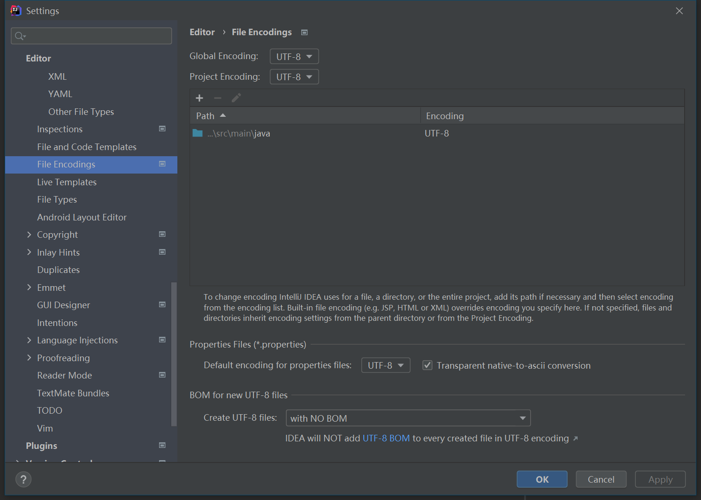
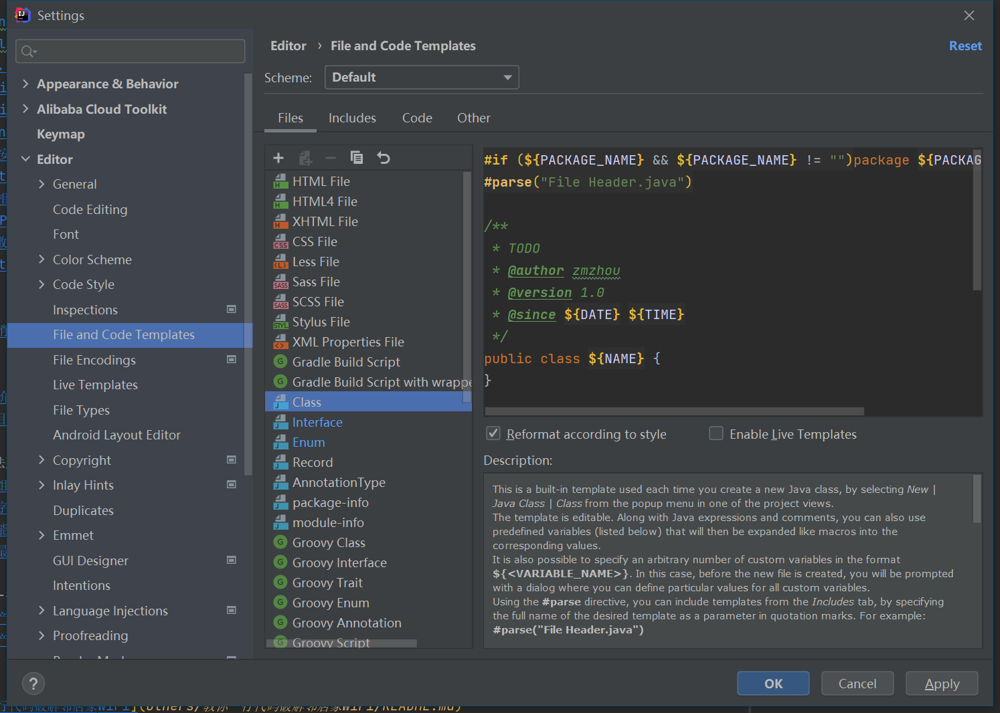
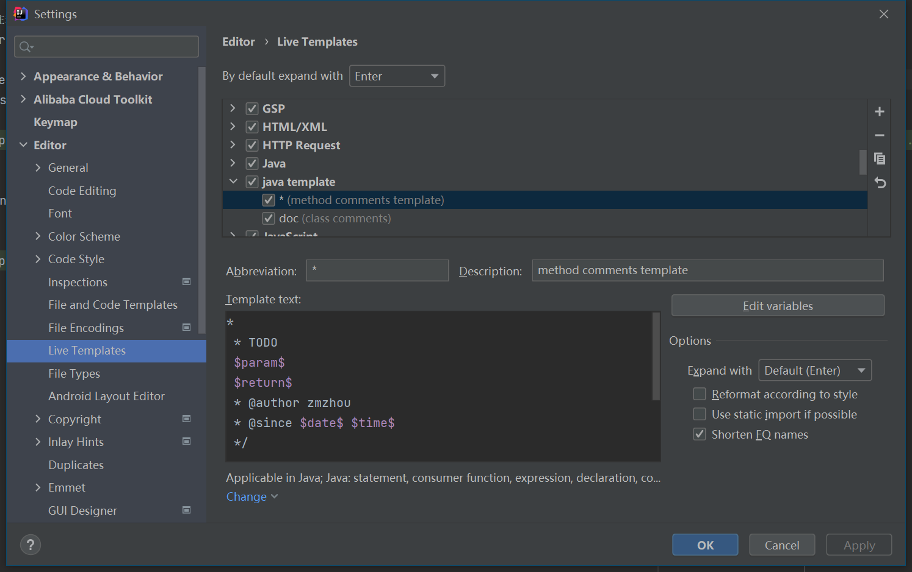
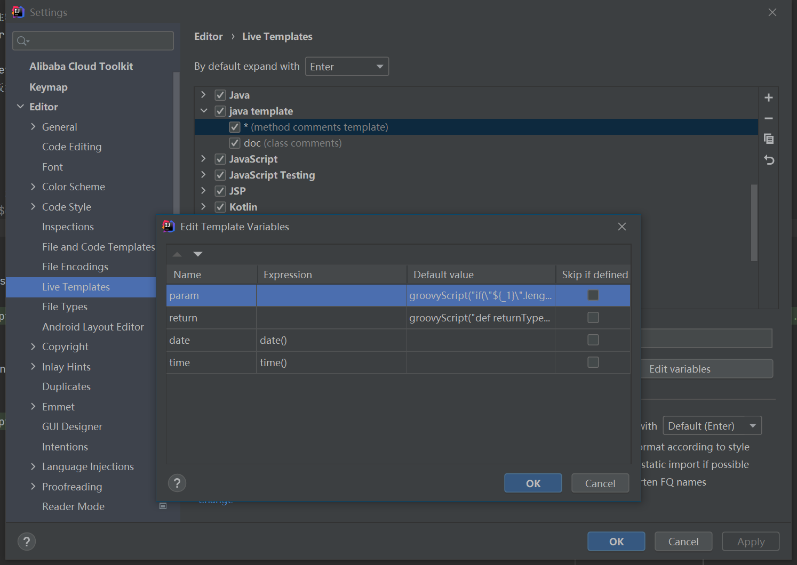
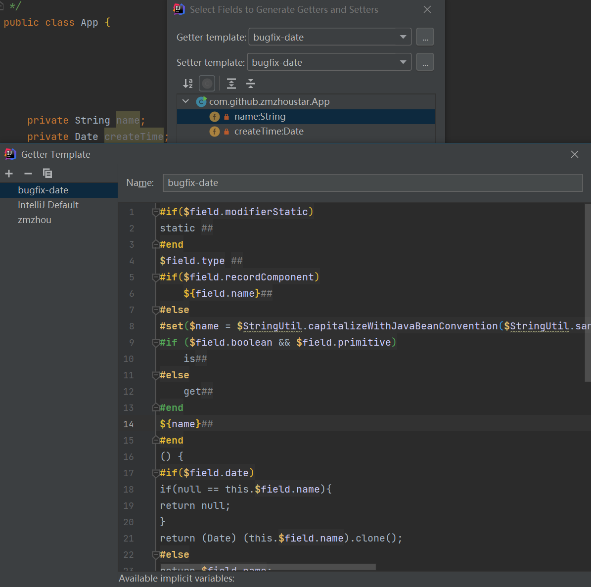
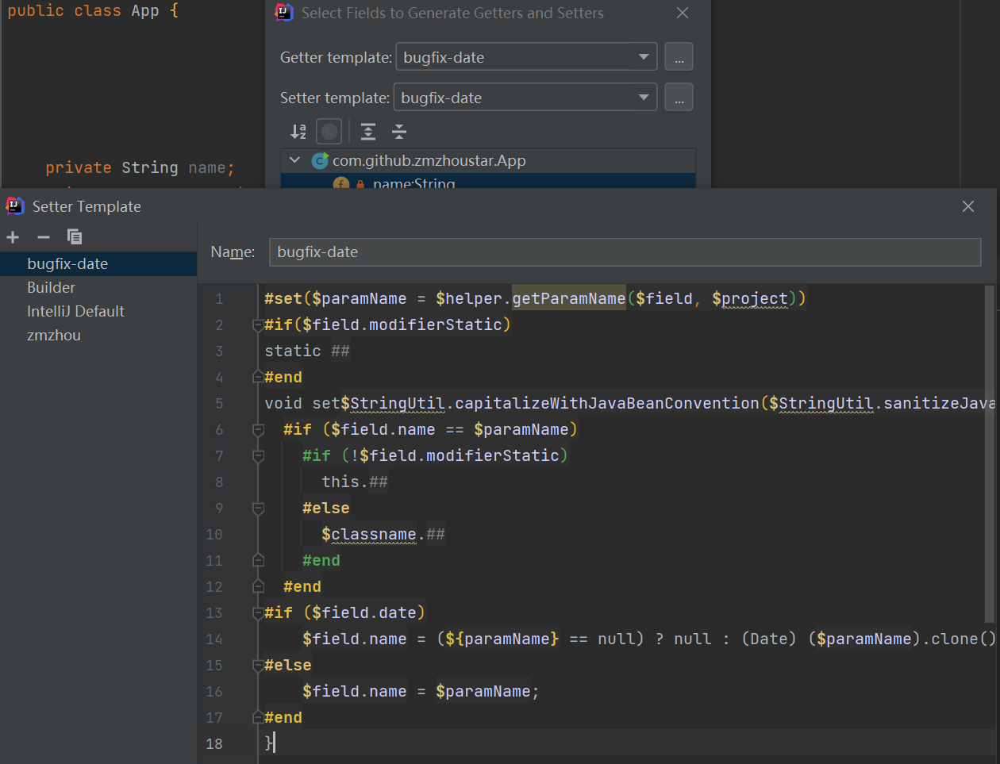

### 一个好的Idea配置能让你的开发工作事半功倍
1. 首先肯定要设置编码集为 **UTF-8**



2. 设置IDEA中类的模板：（IDEA中在创建类时会自动给添加注释）



3. 设置方法注释模板
- /**+Enter，我们按照这种快捷键方式来设置IDEA的方法注释

- File-->Settings-->Editor-->Live Templates
添加 * ，模板如下：
```
*
 * TODO 
 $param$
 $return$
 * @author zmzhou
 * @since $date$ $time$
 */
```



- 点击右侧的Edit variables按钮，设置参数的获取方式
    - 其中params变量的内容一定要放在Default value中！！！内容为：
    ```groovy
    groovyScript("if(\"${_1}\".length() == 2) {return '';} else {def result=''; def params=\"${_1}\".replaceAll('[\\\\[|\\\\]|\\\\s]', '').split(',').toList();for(i = 0; i < params.size(); i++) {if(i==0){result+='* @param ' + params[i] + ' '}else{result+='\\n' + ' * @param ' + params[i] + ' '}}; return result;}", methodParameters());
    ```
    
    - 其中return变量的内容也一定要放在Default value中！！！内容为：
    ```groovy
    groovyScript("def returnType = \"${_1}\"; def result = '* @return ' + returnType; return result;", methodReturnType());
    ```
  


4. Alt+Enter 修改生成日期字段的getter，setter方法

> FindBugs Java 类 Date 属性 Getter/Setter 方法报错
> May expose internal representation by incorporating reference to mutable object

> 正确方法是用日期类的clone方法获取副本进行操作。

- 自定义 **Getter Template** 添加如下代码：

```text
#if($field.modifierStatic)
static ##
#end
$field.type ##
#if($field.recordComponent)
  ${field.name}##
#else
#set($name = $StringUtil.capitalizeWithJavaBeanConvention($StringUtil.sanitizeJavaIdentifier($helper.getPropertyName($field, $project))))
#if ($field.boolean && $field.primitive)
  is##
#else
  get##
#end
${name}##
#end
() {
#if($field.date)
return java.util.Optional.ofNullable(this.$field.name).map(d -> (Date) (d).clone()).orElse(null);
#else
return $field.name;
#end
}
```



- 自定义 **Setter Template** 添加如下代码：

```text
#set($paramName = $helper.getParamName($field, $project))
#if($field.modifierStatic)
static ##
#end
void set$StringUtil.capitalizeWithJavaBeanConvention($StringUtil.sanitizeJavaIdentifier($helper.getPropertyName($field, $project)))($field.type $paramName) {
  #if ($field.name == $paramName)
    #if (!$field.modifierStatic)
      this.##
    #else
      $classname.##
    #end
  #end
#if ($field.date)
    $field.name = java.util.Optional.ofNullable($paramName).map(d -> (Date) (d).clone()).orElse(null);
#else
    $field.name = $paramName;
#end
}
```



- 生成的代码如下：
```java
public class App {
  private Date createTime;
  public Date getCreateTime() {
    return Optional.ofNullable(this.createTime).map(date -> (Date) (date).clone()).orElse(null);
  }
  public void setCreateTime(Date createTime) {
    this.createTime = Optional.ofNullable(createTime).map(date -> (Date) (date).clone()).orElse(null);
  }
}
```