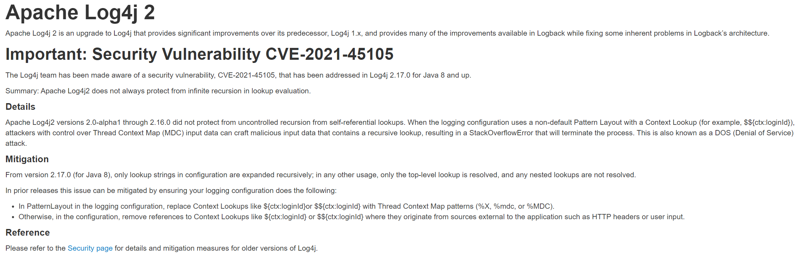
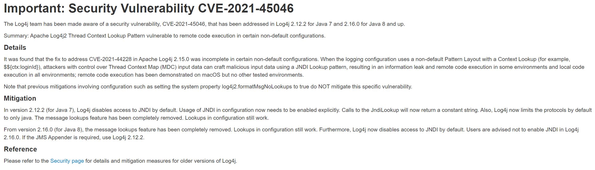
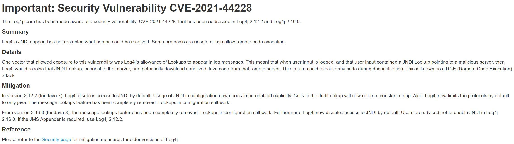
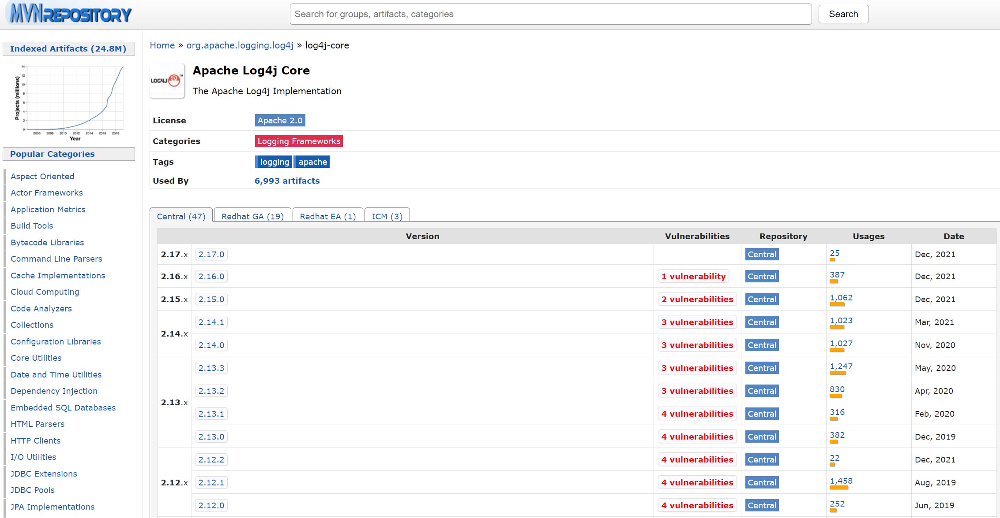
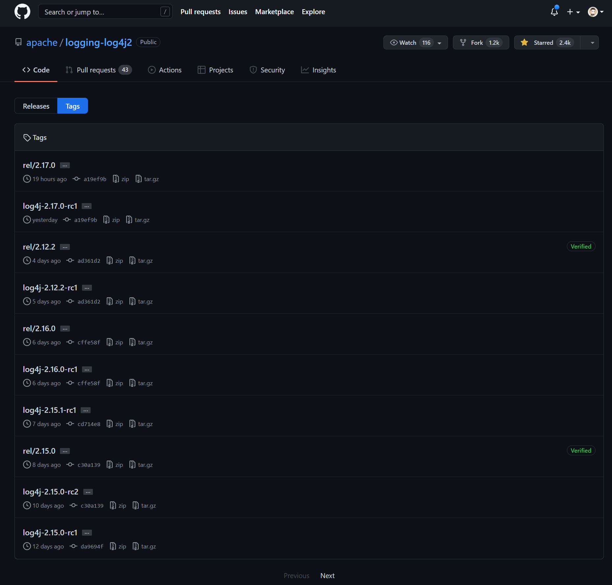

## Apache Log4j 三连鞭
> 刚升级完2.16.0又爆出安全漏洞：CVE-2021-45105 DOS（Denial of Service）拒绝服务攻击

> 还会不会有下一个漏洞呢？







### 漏洞摘要
Log4j 团队又获悉了一个重要的安全漏洞 CVE-2021-45105

| CVE-2021-45105 | 拒绝服务攻击漏洞 |
| :------------: | :------------: |
| 安全等级 |	高 |
| 影响版本 | Log4j2 2.0-alpha1 到 2.16.0 |

> 该漏洞已在支持 Java 8+ 版本的 Log4j 2.17.0 中得到解决，请尽快升级。

### 漏洞详情
因没有防止自引用 lookups 的不受控制的递归，当日志配置使用带有上下文 Lookup 的非默认模式，例如：

$${ctx:loginId}

此时，攻击者可以制作包含递归查找的恶意输入数据，导致 StackOverflowError 错误而终止进程，这也就是 DOS（Denial of Service）拒绝服务攻击。

从 Log4j 2.17.0 版本开始，只有配置中的 lookup 字符串才允许递归扩展，另外，在任何其他用法中，仅解析最顶级的 lookup，不解析任何嵌套的 lookups。

### 解决方案
立马升级到最新版本：Log4j 2.17.0

最新正式版本下载：https://logging.apache.org/log4j/2.x/download.html

最新 Maven 依赖：

```
<!-- https://mvnrepository.com/artifact/org.apache.logging.log4j/log4j-core -->
<dependency>
    <groupId>org.apache.logging.log4j</groupId>
    <artifactId>log4j-core</artifactId>
    <version>2.17.0</version>
</dependency>
```



官网详情：https://logging.apache.org/log4j/2.x/

官网代码仓库地址：[https://github.com/apache/logging-log4j2](https://github.com/apache/logging-log4j2)

最近版本发布很频繁


