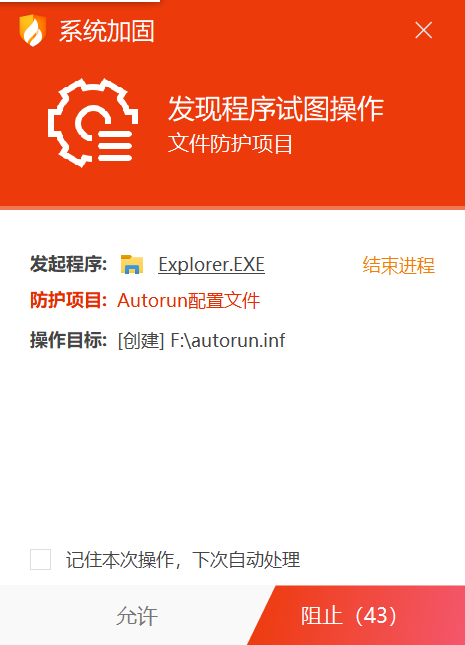
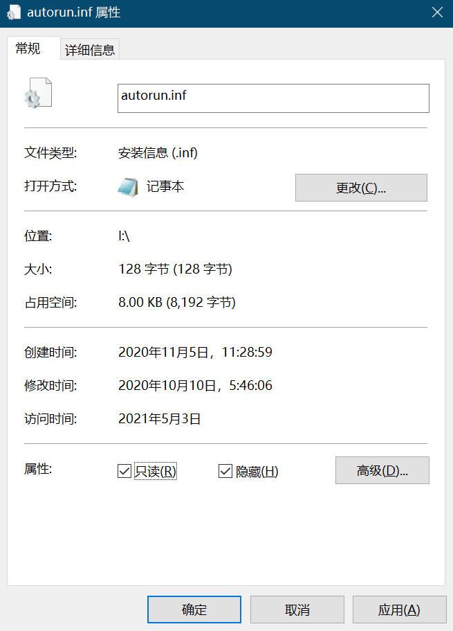
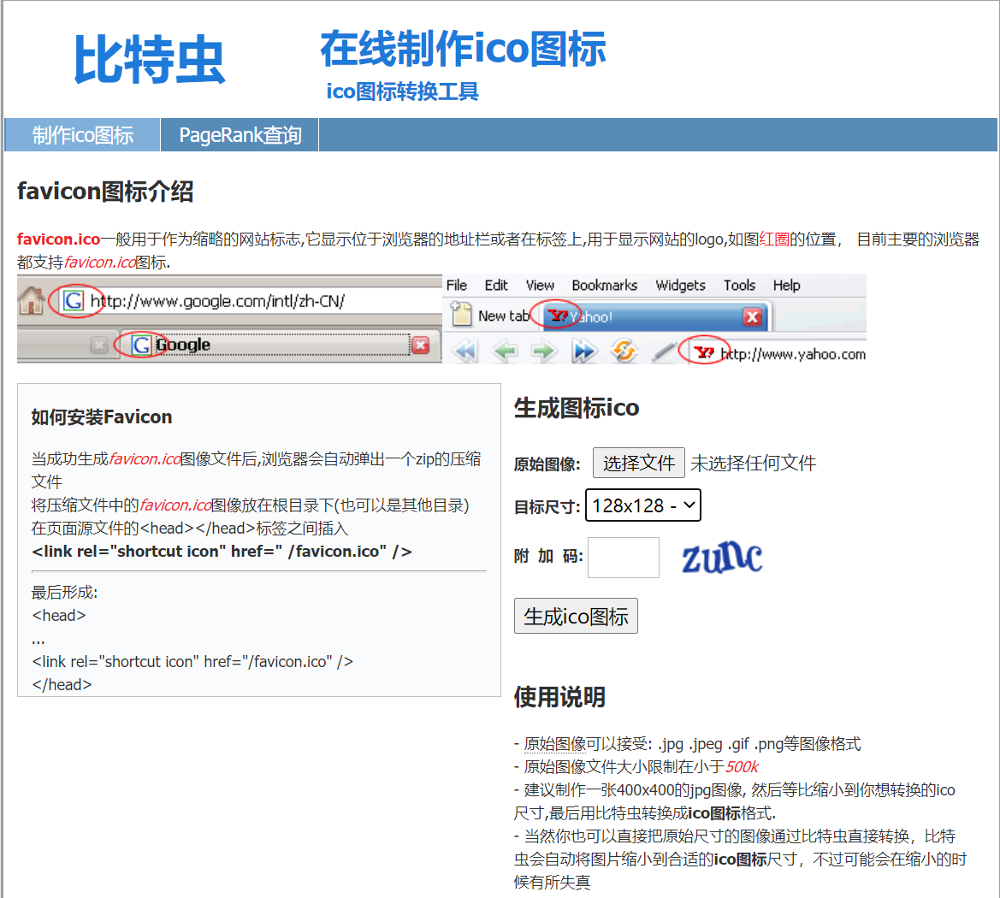
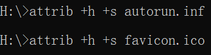

### 原理：病毒在入侵前需要创建`autorun.inf`文件程序来传播；所以我们要在病毒入侵前就创建这个文件，并且不能让病毒修改程序，病毒也就无法传播。走病毒的路，让病毒无路可走！

> 1. 在U盘根目录新建文本文档重命名为 `autorun.inf`



在重命名的时候我们的杀毒软件会有提示，点允许即可。

> 2. 右键 `autorun.inf` 属性修改属性为 `只读` 和 `隐藏`（重要）


到这里我们的U盘就不再中毒啦！
> 3. 我们可以给U盘(磁盘)设置一个喜欢的个性化LOGO

- 先找一个喜欢的图片，也可以去 **iconfont-阿里巴巴矢量图标库** 找一个 [https://www.iconfont.cn/](https://www.iconfont.cn/)
- 打开ico图标转换工具网站 [https://www.bitbug.net/](https://www.bitbug.net/) 按照提示生成ico图标

- 右键 `autorun.inf` 属性修改属性，去掉 `只读`，编辑 **autorun.inf** 如下：
```text
[AutoRun]
icon=favicon.ico,0
```
- 右键 `autorun.inf` 属性修改属性为 `只读` 和 `隐藏`


- 磁盘需要重启系统，U盘重新插入即可


> 或者用命令行隐藏文件或文件夹



如果想显示文件，则执行命令
```
attrib -h -s autorun.inf
attrib -h -s favicon.ico
```