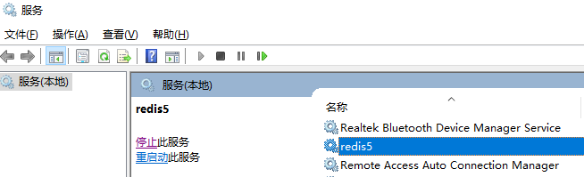

### Linux 源码安装
- 下载地址：[http://redis.io/download](http://redis.io/download)，下载最新稳定版本。
```sh
# wget https://download.redis.io/releases/redis-6.2.2.tar.gz
# tar xzf redis-6.2.2.tar.gz
# cd redis-6.2.2
# make
# 执行完 make 命令后，src 目录下会出现编译后的 redis-server 和 redis-cli 启动程序
# 下面启动 redis 服务
# ./src/redis-server ./redis.conf
# 启动 redis 服务进程后，就可以使用测试客户端程序 redis-cli 和 redis 服务交互了。 比如：
# ./src/redis-cli
redis> set foo bar
OK
redis> get foo
"bar"
```

### Windows 压缩包安装
- Windows最新版下载地址：[https://github.com/tporadowski/redis/releases/download/v5.0.10/Redis-x64-5.0.10.zip](https://github.com/tporadowski/redis/releases/download/v5.0.10/Redis-x64-5.0.10.zip)
1. 解压后在 Redis-x64-5.0.10 当前目录下打开 cmd 窗口
2. 添加Redis服务到注册表

```bat
安装服务：redis-server.exe --service-install redis.windows-service.conf --service-name redis5 --loglevel verbose
启动服务：redis-server.exe --service-start --service-name redis5
停止服务：redis-server.exe --service-stop --service-name redis5
卸载服务：redis-server.exe --service-uninstall --service-name redis5
```

3. 安装服务后 win+r 输入 services.msc 打开服务可以看到 redis5 服务，可以设置开机自启



4. Redis可视化工具安装
- 下载地址：[https://github.com/uglide/RedisDesktopManager/releases/download/0.9.3/redis-desktop-manager-0.9.3.817.exe](https://github.com/uglide/RedisDesktopManager/releases/download/0.9.3/redis-desktop-manager-0.9.3.817.exe)
