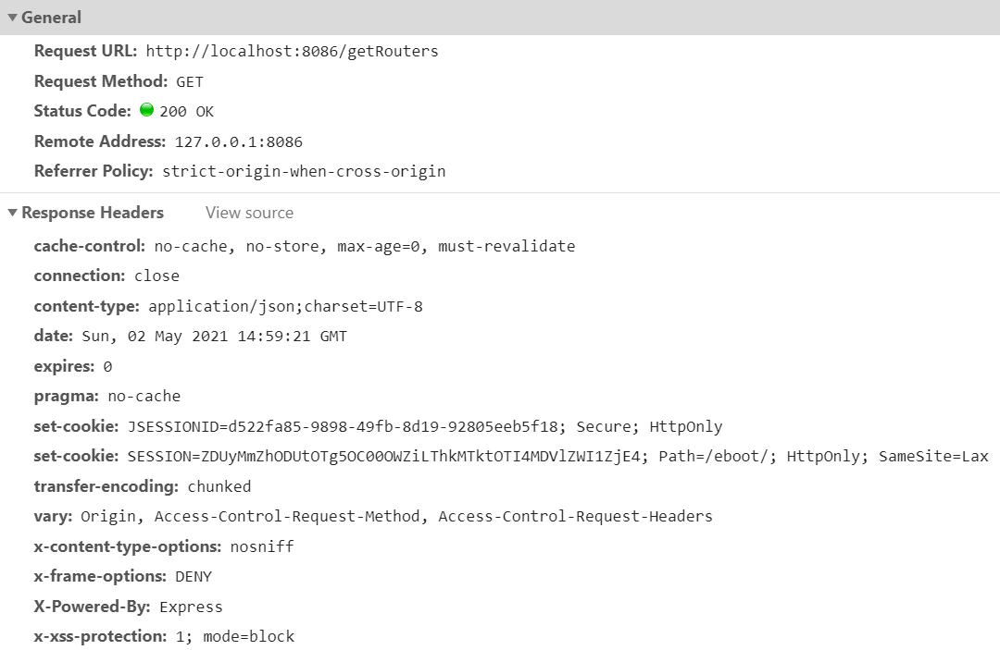
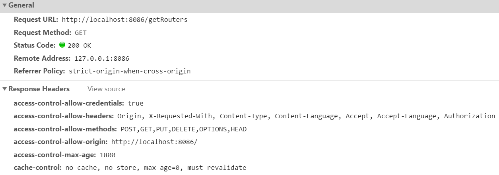

### 首先了解一下什么是跨域请求(CORS)？
- 只要客户端和服务端的 **`请求协议+域名+端口`** 有一个不相同就是跨域请求。不符合`Same Origin Policy`，译为“同源策略”。
- CORS是一个W3C标准，全称是"跨域资源共享"（Cross-origin resource sharing）。
- 它允许浏览器向跨源服务器，发出XMLHttpRequest请求，从而克服了AJAX只能同源使用的限制。
- CORS需要浏览器和服务器同时支持。目前，所有浏览器都支持该功能，IE浏览器不能低于IE10。
- 整个 CORS 通信过程，都是浏览器自动完成，不需要用户参与。对于开发者来说，CORS 通信与普通的 AJAX 通信没有差别，代码完全一样。浏览器一旦发现 AJAX 请求跨域，就会自动添加一些附加的头信息，有时还会多出一次附加的请求(`预检请求`)，但用户不会有感知。因此，实现 CORS 通信的关键是服务器。只要服务器实现了 CORS 接口，就可以跨域通信。
> 预检请求
- 非简单请求是那种对服务器有特殊要求的请求，比如请求方法是PUT或DELETE，或者Content-Type字段的类型是application/json。
- 非简单请求的CORS请求，会在正式通信之前，增加一次HTTP查询请求，称为"预检"请求（preflight）。

- 浏览器先询问服务器，当前网页所在的域名是否在服务器的许可名单之中，以及可以使用哪些HTTP动词和头信息字段。只有得到肯定答复，浏览器才会发出正式的XMLHttpRequest请求，否则就报错。
- 下面是一段浏览器的JavaScript脚本。
```text
var url = 'http://localhost:8086/cors';
var xhr = new XMLHttpRequest();
xhr.open('PUT', url, true);
xhr.setRequestHeader('X-Custom-Header', 'value');
xhr.send();
```
上面代码中，HTTP请求的方法是PUT，并且发送一个自定义头信息X-Custom-Header。
- 浏览器发现，这是一个非简单请求，就自动发出一个"预检"请求，要求服务器确认可以这样请求。下面是这个"预检"请求的HTTP头信息。
```text
OPTIONS /cors HTTP/1.1
Origin: http://localhost:8086
Access-Control-Request-Method: PUT
Access-Control-Request-Headers: X-Custom-Header
Host: localhost:8086
Accept-Language: en-US
Connection: keep-alive
User-Agent: Mozilla/5.0 (Windows NT 10.0; Win64; x64) AppleWebKit/537.36 (KHTML, like Gecko) Chrome/90.0.4430.93 Safari/537.36
```
- "预检"请求用的请求方法是OPTIONS，表示这个请求是用来询问的。头信息里面，关键字段是Origin，表示请求来自哪个源。
- 除了Origin字段，"预检"请求的头信息包括两个特殊字段。
  - `Access-Control-Request-Method`
  - 该字段是必须的，用来列出浏览器的CORS请求会用到哪些HTTP方法，上例是PUT。
  - `Access-Control-Request-Headers`
  - 该字段是一个逗号分隔的字符串，指定浏览器CORS请求会额外发送的头信息字段，上例是X-Custom-Header。
### 两种请求
- 浏览器将CORS请求分成两类：简单请求（simple request）和非简单请求（not-so-simple request）。
> 只要同时满足以下两大条件，就属于简单请求。
```text
（1) 请求方法是以下三种方法之一：
HEAD 
GET 
POST 
（2）HTTP的头信息不超出以下几种字段：
Accept
Accept-Language
Content-Language
Last-Event-ID
Content-Type：只限于三个值application/x-www-form-urlencoded、multipart/form-data、text/plain
这是为了兼容表单（form），因为历史上表单一直可以发出跨域请求。AJAX 的跨域设计就是，只要表单可以发，AJAX 就可以直接发。
```
凡是不同时满足上面两个条件，就属于非简单请求。 浏览器对这两种请求的处理，是不一样的。
### 跨域的三种解决办法
#### 方法一：全局配置(推荐)
```java
import org.springframework.context.annotation.Configuration;
import org.springframework.web.servlet.config.annotation.CorsRegistry;
import org.springframework.web.servlet.config.annotation.ResourceHandlerRegistry;
import org.springframework.web.servlet.config.annotation.WebMvcConfigurer;
@Configuration
public class EasyWebMvcConfigurer implements WebMvcConfigurer {
    /**
     * 解决静态资源无法访问
     * @param registry ResourceHandlerRegistry
     * @author zmzhou
     * @date 2020/07/02 19:35
     */
    @Override
    public void addResourceHandlers(ResourceHandlerRegistry registry) {
        // 解决静态资源无法访问
        registry.addResourceHandler("/**")
                .addResourceLocations("classpath:/static/")
                .addResourceLocations("classpath:/templates/");
    }
    /**
     * 允许所有跨站请求
     * @param registry CorsRegistry
     * @author zmzhou
     * @date 2020/07/03 15:09
     */
    @Override
    public void addCorsMappings(CorsRegistry registry) {
    	  // Add more mappings... 可以添加多个mapping
        registry.addMapping("/**")
            // 服务器支持的所有头信息字段
            .allowedHeaders("*")
            // 服务器支持的所有跨域请求的方法
            .allowedMethods("POST", "GET", "PUT", "DELETE", "OPTIONS", "HEAD")
            // 是否允许发送Cookie
            .allowCredentials(true)
            // 指定本次请求的有效期
            .maxAge(1800)
            // 设置允许跨域请求的域名
            .allowedOriginPatterns("*");
    }
}
```

#### 方法二：基于过滤器 这种方式很容易理解，就是在每个请求的response中写入 Access-Control-* 这些响应头
```java
import java.io.IOException;
import javax.servlet.Filter;
import javax.servlet.FilterChain;
import javax.servlet.ServletException;
import javax.servlet.ServletRequest;
import javax.servlet.ServletResponse;
import javax.servlet.annotation.WebFilter;
import javax.servlet.http.HttpServletResponse;
import org.springframework.context.annotation.Configuration;
@WebFilter(filterName = "myCorsFilter")
@Configuration
public class MyCorsFilter implements Filter {
  @Override
  public void doFilter(ServletRequest request, ServletResponse res, FilterChain chain) throws IOException,
    ServletException {
    HttpServletResponse response = (HttpServletResponse) res;
    // 设置允许跨域请求的域名
    response.setHeader("Access-Control-Allow-Origin", "http://localhost:8086/");
    // 是否允许发送Cookie
    response.setHeader("Access-Control-Allow-Credentials", "true");
    // 服务器支持的所有跨域请求的方法
    response.setHeader("Access-Control-Allow-Methods", "POST,GET,PUT,DELETE,OPTIONS,HEAD");
    // 指定本次请求的有效期
    response.setHeader("Access-Control-Max-Age", "1800");
    // 服务器支持的所有头信息字段
    response.setHeader("Access-Control-Allow-Headers", "Origin, X-Requested-With," +
      " Content-Type, Content-Language, Accept, Accept-Language, Authorization");
    chain.doFilter(request, response);
  }
}
```

> 基于过滤器第二种写法，使用`org.springframework.web.filter.CorsFilter`
```java
import java.util.Arrays;
import org.springframework.web.cors.CorsConfiguration;
import org.springframework.web.cors.UrlBasedCorsConfigurationSource;
import org.springframework.web.filter.CorsFilter;
import org.springframework.context.annotation.Configuration;
@Configuration
public class EasyWebMvcConfigurer {
  @Bean
  public CorsFilter corsFilter() {
    CorsConfiguration config = new CorsConfiguration();
    config.setAllowCredentials(true);
    config.addAllowedOrigin("http://localhost:8086");
    config.setAllowedHeaders(Arrays.asList(("Origin,X-Requested-With,Content-Type,Content-Language,Accept," +
      "Accept-Language,Authorization").split(",")));
    config.setAllowedMethods(Arrays.asList("POST,GET,PUT,DELETE,OPTIONS,HEAD".split(",")));
    config.setMaxAge(1800L);
    UrlBasedCorsConfigurationSource source = new UrlBasedCorsConfigurationSource();
    source.registerCorsConfiguration("/**", config);
    return new CorsFilter(source);
  }
}
```
#### 方法三：**@CrossOrigin** 注解，可以放在 **method** 或者 **class** 上面
```java
import org.springframework.web.bind.annotation.CrossOrigin;
import org.springframework.web.bind.annotation.RequestMapping;
import org.springframework.web.bind.annotation.RestController;
@RestController
@RequestMapping("/login")
@CrossOrigin(origins = "http://localhost:8086")
public class LoginController {
}
```