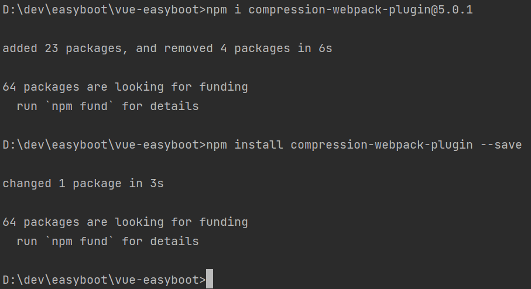
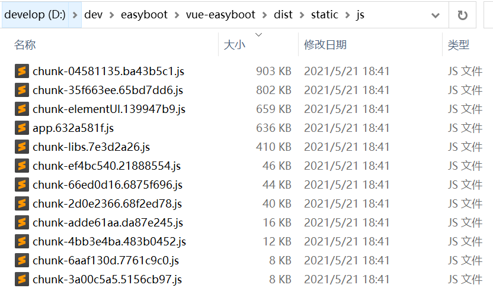

### 前言
这段时间因为免费试用了[https://free.aliyun.com/](https://free.aliyun.com/?spm=5176.22772544.J_2522816790.6.29b22ea9se6d3d)一台阿里云的服务器，配置是 2核4G 2M，
因为带宽太低了，每次在第一次加载的时候太慢了，通过F12调试，发现主要是因为加载的 js 过大而引起的。因此本文将主要讲解Vue项目打包后js、css、svg等文件过大的解决办法。


### 引入插件 `compression-webpack-plugin`
通过引入 compression-webpack-plugin 插件来打包，然后开启 nginx gzip 来解决问题
> CompressionWebpackPlugin插件参数配置：官网 [https://www.webpackjs.com/plugins/compression-webpack-plugin/](https://www.webpackjs.com/plugins/compression-webpack-plugin/)
- 安装插件依赖

```shell
#指定版本
npm i compression-webpack-plugin@5.0.1
#或者
npm i -D compression-webpack-plugin
npm install compression-webpack-plugin --save
```


- 说明
  - i 是install 的简写
  - -S就是--save的简写
  - -D就是--save-dev 这样安装的包的名称及版本号就会存在package.json的devDependencies这个里面，而--save会将包的名称及版本号放在dependencies里面。

- 修改 `vue.config.js` 文件，内容如下

```js
const CompressionPlugin = require('compression-webpack-plugin');
const productionGzipExtensions = /\.(js|css|json|txt|html|ico|svg)(\?.*)?$/i;
module.exports = {
  publicPath: '/',
  productionSourceMap: false,
  configureWebpack: {...},
  chainWebpack: config => {
    config.resolve.alias.set('@', resolve('src'));
    config.when(process.env.NODE_ENV !== 'development',
        config => {
          // 提供带 Content-Encoding 编码的压缩版的资源
          config.plugin('compressionPlugin')
            .use(new CompressionPlugin({
              filename: '[path].gz[query]', // 目标文件名
              algorithm: 'gzip',  // 压缩算法
              test: productionGzipExtensions, // 满足正则表达式的文件会被压缩
              threshold: 10240, // 只处理比这个值大的资源。按字节计算 10240=10KB
              minRatio: 0.8, // 只有压缩率比这个值小的资源才会被处理
              deleteOriginalAssets: true // 是否删除原资源
            }));
        }
      )
  }
}
```
> 更多详细配置请查看本项目代码，地址：[https://gitee.com/zmzhou-star/easyboot.git](https://gitee.com/zmzhou-star/easyboot.git)

### Vue项目打包

```shell
npm run build:prod
```
配置 `compression-webpack-plugin` 前后打包对比，我们查看 dist目录，能够发现大于10KB的 **js**，**css** 等文件已经被压缩了

> 配置 `compression-webpack-plugin` 前



> 配置 `compression-webpack-plugin` 后


### 修改Nginx配置 开启 **gzip**

```bash
# on为启用，off为关闭
gzip on;
# Nginx的动态压缩是对每个请求先压缩再输出，这样造成虚拟机浪费了很多cpu，解决这个问题可以利用nginx模块Gzip Precompression，这个模块的作用是对于需要压缩的文件，直接读取已经压缩好的文件(文件名为加.gz)，而不是动态压缩，对于不支持gzip的请求则读取原文件
gzip_static on;
# 设置允许压缩的页面最小字节数，页面字节数从header头中的Content-Length中进行获取。默认值是0，不管页面多大都压缩。建议设置成大于1k的字节数，小于1k可能会越压越大。
gzip_min_length 1k;
# 获取多少内存用于缓存压缩结果，‘4 32k’表示以4*32k为单位获得
gzip_buffers 4 32K;
# 识别http协议的版本,早期浏览器可能不支持gzip自解压,用户会看到乱码
gzip_http_version 1.1;
# gzip压缩比（1~9），越小压缩效果越差，但是越大处理越慢，所以一般取中间值;
gzip_comp_level 5;
# 对特定的MIME类型生效,其中'text/html’被系统强制启用
gzip_types text/plain application/x-javascript text/css application/xml application/javascript;
# 启用应答头"Vary: Accept-Encoding"
gzip_vary on;
# IE5.5和IE6 SP1使用msie6参数来禁止gzip压缩 )指定哪些不需要gzip压缩的浏览器(将和User-Agents进行匹配),依赖于PCRE库
gzip_disable "MSIE [1-6].";
```
> 完整Nginx配置请看 [Nginx安装](/Linux/Nginx安装/README.md)
> 
- 重启 **nginx**
```shell
systemctl reload nginx
```

### 测试效果，访问：`http://120.78.87.244`，F12打开开发者工具

> 压缩前


> 压缩后，发现响应时间得到了明显提升

