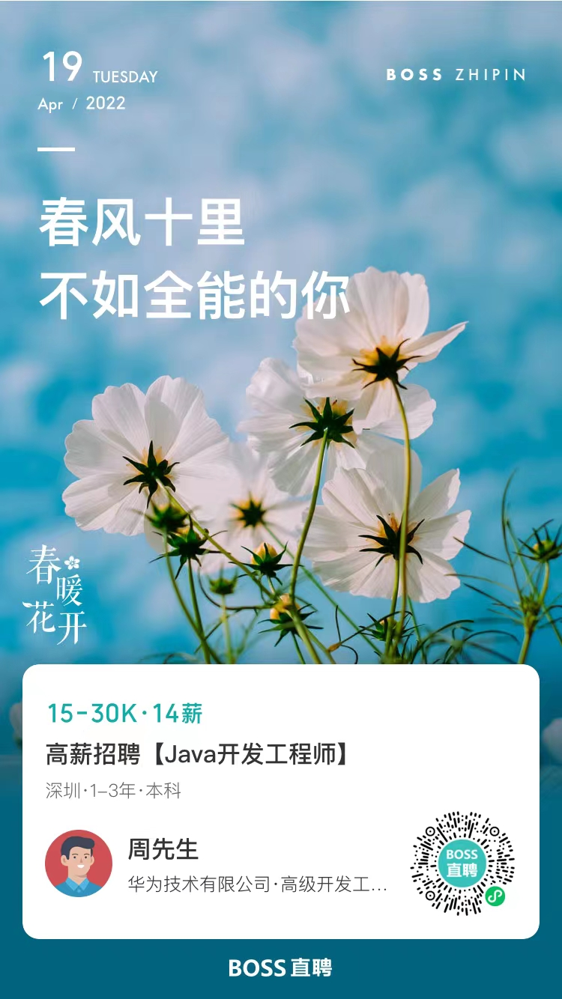

# 华为OD招聘，月薪15-30k年终奖>2个月。(下面有OD介绍)
> 招聘岗位有：Java开发工程师、Web前端开发工程师、Python开发工程师、ETL工程师、大数据工程师、BI工程师、测试工程师等等

1. 岗位职责：开源及第三方软件管理系统解决方案设计与开发。
2. 技能要求：精通JAVA、Python或JavaScript其中一种。
3. 学历要求：本科两年工作经验研究生一年工作经验。（能力优秀的目标院校应届毕业生也可）
4. 工作地：深圳，成都，东莞，南京，西安，北京，上海。
5. 招聘流程（全程线上）：
   1. 编程技术测试(机考，需要提供身份证)
   2. 综合测试(网考)
   3. 技术面试(两轮视频面试)
   4. hr综合面试(视频面试)
6. 任职部门：2012实验室》产品数字化与IT装备部》PLM应用开发部

> 机试说明：
> 1. 机试有JAVA，Python，JavaScript，可以选择你擅长的语言。提供**姓名、身份证、邮箱、电话号码**，机考通知发到你的邮箱，半个月内完成考试即可。
> 机考是三道简单算法题，前面两道各100分，第三道是200分；总分150分通过。可以提前去 [牛客网](https://www.nowcoder.com/) 刷刷题，熟悉编程环境。
> 2. 机试需要打开电脑摄像头，不要百度，不要查资料，不然会判作弊。
> 3. 题目难度可以参考本站面试题(算法题)章节。

> 很多候选人对于需要提供身份证号码比较抵触，为什么要提供身份证呢？
> 因为华为公司应聘者很多，为了提高面试效率，避免短时间内重复面试同一个人，避免不同部门之间“抢人”，只有身份证号码是唯一的。
> A部门锁定候选人之后一个月内，不能再面试其他部门，还有两个重要原因
> 1. 如果候选人机考没通过，半年内不能再次应聘。
> 2. 如果候选人综合测试没通过，一年半内不能再次应聘。

> OD介绍：华为OD招聘是目前华为社招的唯一通道，OD员工与华为员工同工同酬，由华为直接管理，在一起办公，只是与外企德科签订合同。定级D1-D5，对应华为13-17级。能力要求和薪酬待遇与华为员工对应级别一致。

> OD转华为条件：
> 1. 入职一年
> 2. 绩效优秀者
> 3. 通过软件可信专业级认证。注:软件可信是华为软件开发员工都需要通过的认证，包含四门专业考试。（科目一是上机编程，另外三门是客观题，看文档就能通过。）

注：现在OD转华为的政策非常清晰每个月都会审视，满足条件的员工都可以转华为。入职一年，考评优秀，通过可信专业认证可以转华为。目前已经有十五批OD员工转华为了。

## 欢迎来撩，简历投递通道
1. Email：<a href="mailto:zhouzhongmin2@huawei.com">zhouzhongmin2@huawei.com</a>
2. BOSS直聘

   