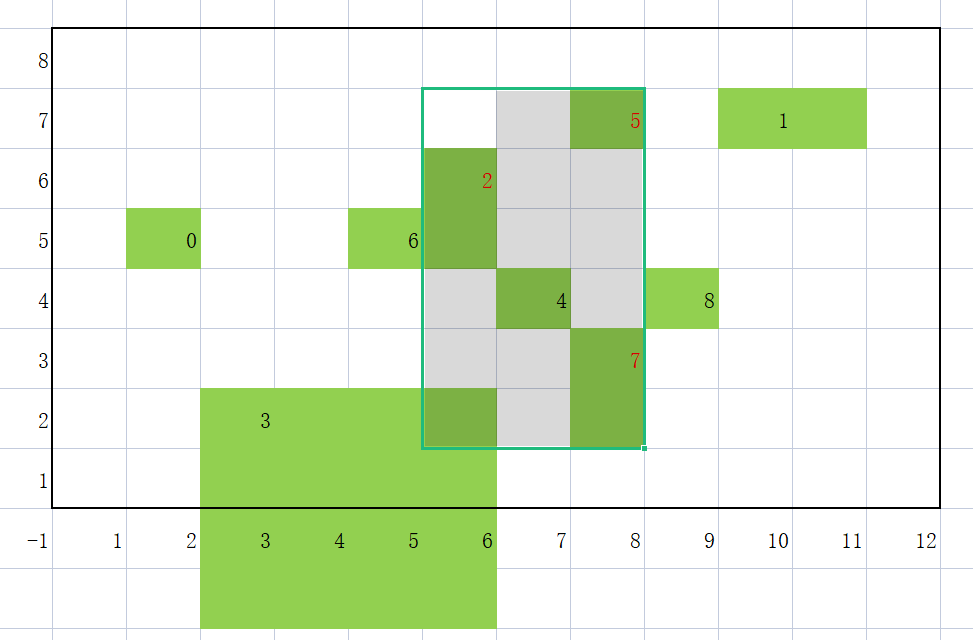

## 求最小脏矩阵的序列

* 矩阵:matrix matrix[i][0],matrix[i][1]表示矩形左上角X坐标，Y坐标 matrix[i][2],matrix[i][3]表示宽度和高度
* X坐标，Y坐标 <= 1000
* dirtySequences数组表示dirty矩形的数组下标
* 求：dirty矩阵的下标（含重叠矩形）

* 输入示例1：
```
9
1 5 1 1
9 7 2 1
5 6 1 2
2 2 4 4
6 4 1 1
7 7 1 1
4 5 1 1
7 3 1 2
8 4 1 1
2 5 7
```

参考示意图：


### 解题

[最小脏矩阵](https://gitee.com/zmzhou-star/learnotes/raw/master/src/main/java/com/github/zmzhoustar/DirtyMatrix.java)

## 常见机考题
1. 单词加密
2. 玩牌高手
3. 找出符合要求的字符串子串
4. 消消乐游戏
5. 仿LISP运算
6. 用连续自然数之和来表达整数
7. 字符串筛选排序
8. 两数之和绝对值最小
9. 转骰子
10. 内存资源分配
11. 5键盘的输出
12. 太阳能板最大面积
13. 寻找身高相近的小朋友
14. 数组去重和排序
15. 整型数组按个位值排序
16. 最小传输时延

[华为机试常见考题](https://blog.nowcoder.net/zhuanlan/v0Eoqj)

[练习地址](https://www.nowcoder.com/ta/huawei)