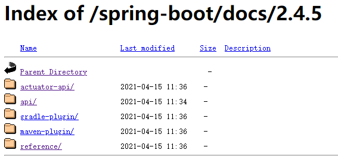
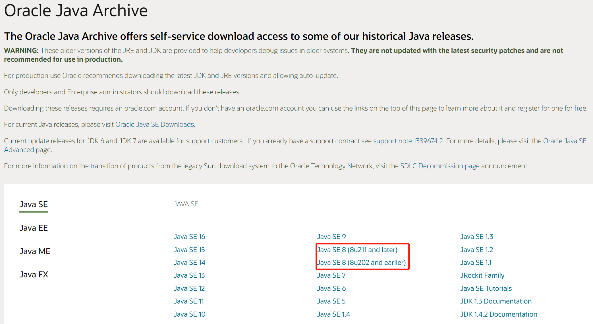
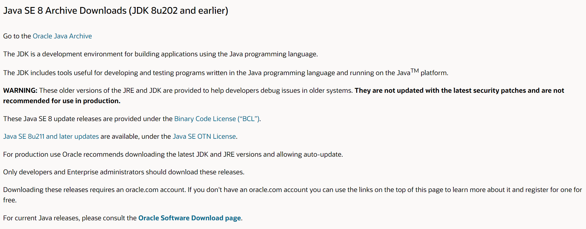
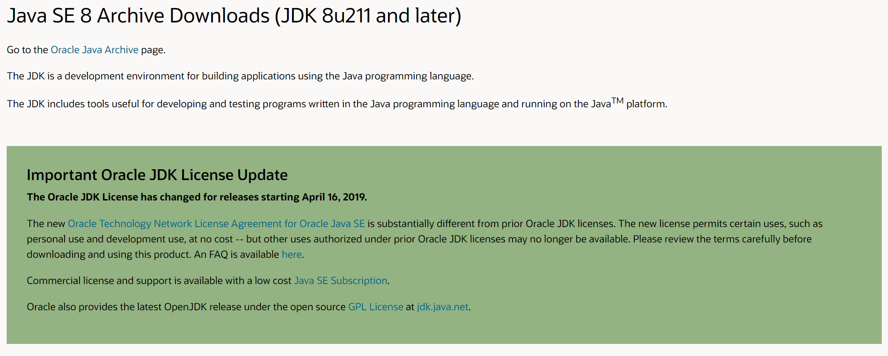

- 阿里云-知行动手实验室 [https://start.aliyun.com/](https://start.aliyun.com/)
- Spring Initializr [https://start.spring.io/](https://start.spring.io/)
- spring boot文档 [https://docs.spring.io/spring-boot/docs/2.4.5/](https://docs.spring.io/spring-boot/docs/2.4.5/)
  - 文档分为5个部分，分别是 actuator-api/，api/ ，gradle-plugin/，maven-plugin/，reference/，如图所示：
  
  - 主要文档是reference部分，maven配置技巧是maven-plugin部分
- maven仓库 [http://mvnrepository.com/](http://mvnrepository.com/)
- 阿里云云效 Maven中央仓库 [https://maven.aliyun.com/mvn/guide](https://maven.aliyun.com/mvn/guide)
- 开源中国-在线工具 [https://tool.oschina.net/](https://tool.oschina.net/)
- jdk1.8最高版本商用免费版下载地址 [https://www.oracle.com/java/technologies/javase/javase8-archive-downloads.html](https://www.oracle.com/java/technologies/javase/javase8-archive-downloads.html)
  - 我们进入Oracle Java Archive页面，可以看到Java SE版本列表，最显眼的就是Java SE 8 (8u211 and later)和Java SE 8 (8u202 and earlier)两个分类，他们分别属于两个不同的协议
  
  
  - 当我们下载OTN协议版本jdk的时候会看到提醒：The Oracle JDK License has changed for releases starting April 16, 2019.
  
  - JDK使用什么协议？
    - [BCL](https://www.oracle.com/downloads/licenses/binary-code-license.html) 协议，即Oracle Binary Code License Agreement，协议规定你可以使用JDK，但是不能进行修改。私用和商用都可以，但是JDK中的某些商业特性，是需要付费才可以使用的。
    - [OTN](https://www.oracle.com/downloads/licenses/javase-license1.html) 协议，即Oracle Technology Network License Agreement，目前新发布的JDK用的都是这个协议，可以私用，商用需要付费。
  - 各个版本对应的协议

    |JDK版本|BCL协议|OTN协议|
    | :---: | :---: | :---: |
    |8|8u202之前|8u211之后|
    |9|是|否|
    |10|是|否|
    |11-16|否|是|
  - 虽然OTN协议版本JDK也支持Personal Use,Development Use，但是如果我们在做公司项目的时候生产上用了，这样就导致了商用项目未经许可违规使用。Oracle法务部可不是吃素的，所以我们开发过程中就养成良好的习惯，避免不必要的麻烦。
- 站长之家 [http://tool.chinaz.com/](http://tool.chinaz.com/)
- sojson-在线工具 [https://www.sojson.com/](https://www.sojson.com/)
- JavaScript加密、压缩 [https://www.jsjiami.com/](https://www.jsjiami.com/)
- 便民查询网 [https://www.bmcx.com/](https://www.bmcx.com/)
- 在线制作ico图标 [https://www.bitbug.net/](https://www.bitbug.net/)
- iconfont-阿里巴巴矢量图标库 [https://www.iconfont.cn/](https://www.iconfont.cn/)
- 一个**提供免费HTTPS证书申请**的网站 [https://freessl.cn/](https://freessl.cn/)
- 下载您丢失的DLL文件 [https://cn.dll-files.com/](https://cn.dll-files.com/)
- vue.js [https://v3.cn.vuejs.org/](https://v3.cn.vuejs.org/)
- Vue CLI [https://cli.vuejs.org/zh/](https://cli.vuejs.org/zh/)
- webpackjs中文文档 [https://www.webpackjs.com/](https://www.webpackjs.com/concepts/)
- vue-element-admin 是一个后台前端解决方案，它基于 vue 和 element-ui实现。[https://panjiachen.gitee.io/vue-element-admin-site/zh/](https://panjiachen.gitee.io/vue-element-admin-site/zh/)
- Element Plus [https://element-plus.gitee.io/#/zh-CN](https://element-plus.gitee.io/#/zh-CN)
- electron-vue [https://simulatedgreg.gitbooks.io/electron-vue/content/cn/](https://simulatedgreg.gitbooks.io/electron-vue/content/cn/)
- uni-app 是一个使用 Vue.js 开发所有前端应用的框架，一套代码编到10个平台 [https://uniapp.dcloud.net.cn/README](https://uniapp.dcloud.net.cn/README)
- 轻量、可靠的移动端 Vue 组件库  [https://youzan.github.io/vant](https://youzan.github.io/vant)
- 轻量、可靠的小程序 UI 组件库  [https://youzan.github.io/vant-weapp/](https://youzan.github.io/vant-weapp/)
- 使用 Vue.js 跨平台开发高质量原生（Android/iOS）应用 [https://eeui.app/](https://eeui.app/)
- 腾讯云+社区开发者手册 [https://cloud.tencent.com/developer/devdocs](https://cloud.tencent.com/developer/devdocs)
- 华中科技大学开源镜像站 [http://mirror.hust.edu.cn/](http://mirror.hust.edu.cn/)
- 清华大学开源软件镜像站 [https://mirrors.tuna.tsinghua.edu.cn/](https://mirrors.tuna.tsinghua.edu.cn/)
- 微信公众平台 [https://mp.weixin.qq.com/](https://mp.weixin.qq.com/)
- weui [https://weui.io/](https://weui.io/)
-  Markdown 排版网站  [http://md.aclickall.com/](http://md.aclickall.com/)
-  Markdown 排版网站  [https://www.mdnice.com/](https://editor.mdnice.com/)
- Canva 在线平面设计 [https://www.canva.cn/templates/](https://www.canva.cn/templates/)
- Fast badge generating service [https://badgen.net/](https://badgen.net/)
- CSS 教程手册  [https://www.css88.com/book/css/](https://www.css88.com/book/css/)
- 免费在线作图、实时协作 [https://v3.processon.com/](https://v3.processon.com/)
- Node.js 中文网 [http://nodejs.cn/](http://nodejs.cn/)
- HTML5+中国产业联盟 [https://www.html5plus.org/doc/jsdocp.html](https://www.html5plus.org/doc/jsdocp.html)
- 国密算法 [http://gmssl.org/docs/quickstart.html](http://gmssl.org/docs/quickstart.html)
- 格式工厂 [http://www.pcgeshi.com/](http://www.pcgeshi.com/)
- docsify文档 [https://docsify.js.org/#/zh-cn/](https://docsify.js.org/#/zh-cn/)
- unpkg是npm上所有内容的快速，全球内容交付网络。 [https://unpkg.com/](https://unpkg.com/browse/prismjs@1.23.0/)
- A free CDN for Open Source [https://cdn.jsdelivr.net/](https://www.jsdelivr.com/)
- 防止XSS攻击 [https://jsxss.com/zh/index.html](https://jsxss.com/zh/index.html)
  
- 学位网|中国学位认证 [https://www.chinadegrees.cn/cqva/account/login.html](https://www.chinadegrees.cn/cqva/account/login.html)
- 中国高等教育学生信息网（学信网） [https://my.chsi.com.cn/archive/index.jsp](https://my.chsi.com.cn/archive/index.jsp)
- 中国知网 [https://www.cnki.net/](https://www.cnki.net/)

- Github常见标签生成网站 [https://shields.io/](https://shields.io/)
- Github常见标签生成网站 [https://badgen.net/](https://badgen.net/)